# Methods, Steps, and Results: Bacterial Genome Constraint Analysis - KEGG Pathway Version

**Comprehensive Documentation of Statistical Scaling Analyses and Environment Prediction Using KEGG Pathways**

---

## Table of Contents

1. [Executive Summary](#executive-summary)
2. [Introduction](#introduction)
3. [Data and Quality Control](#data-and-quality-control)
4. [Methods: Statistical Scaling Analyses](#methods-statistical-scaling-analyses)
5. [Methods: Environment Prediction](#methods-environment-prediction)
6. [Results: Statistical Scaling Analyses](#results-statistical-scaling-analyses)
7. [Results: Environment Prediction](#results-environment-prediction)
8. [Metabolic Pathway Analysis](#metabolic-pathway-analysis)
9. [Discussion and Interpretation](#discussion-and-interpretation)
10. [Conclusions](#conclusions)

---

## Executive Summary

This study investigates the relationship between bacterial genome size and functional gene content across different environments, using two complementary approaches:

1. **Statistical Scaling Analyses**: Power-law scaling relationships between genome size and KEGG pathway counts, with environment-specific deviations quantified using Z-statistics.
2. **Environment Prediction**: Supervised machine learning to predict environment from genomic features (KEGG pathways and genome size).

**Key Findings:**
- **99% Prevalence Threshold**: 29 KEGG pathways analyzed across 2,164 high-quality genomes
- **Scaling Exponents**: Most pathways show sub-linear scaling (α < 1), with significant environment-specific variation
- **Environment Prediction**: 54.38% test accuracy (Random Forest), 36.25% balanced accuracy
- **Top Predictive Features**: Metabolic pathways, microbial metabolism pathways, biosynthesis pathways, and genome size

---

## Introduction

### Research Questions

1. **How does functional gene content scale with genome size?**
   - Do different KEGG pathways scale differently?
   - Are scaling relationships universal or environment-specific?

2. **Can we predict environment from genomic features?**
   - Which KEGG pathways are most predictive of environment?
   - How well does genome size alone predict environment?

3. **What is the role of metabolism in environment-specific scaling?**
   - Do metabolic pathways show distinct scaling patterns?
   - Are metabolic pathways environment-specific?

### Dataset Overview

- **Total Genomes Analyzed**: 2,164 high-quality bacterial genomes
- **Environments**: 8 categories (Aquatic, Terrestrial, Mammals: Human, Plants, Mammals, Food production, Wastewater, Birds)
- **KEGG Pathways (99% Prevalence)**: 29 pathways present in ≥99% of genomes
- **Total KEGG Pathways**: 101 pathways (map identifiers only, excluding rn duplicates)

### Prevalence Threshold Comparison

| Metric | 95% Threshold | 99% Threshold | Change |
|--------|---------------|---------------|--------|
| Total KEGG pathways | ~50-60 | 29 | ~-50% |
| Genomes analyzed | 2,164 | 2,164 | Same |

**Justification for 99% Threshold**: Focuses on truly ubiquitous pathways, reducing noise from rare environment-specific annotations while maintaining sufficient feature diversity for prediction. Pathway-level analysis provides higher-level functional organization compared to individual reactions or KOs.

---

## Data and Quality Control

### Data Sources

1. **NCBI Genomes**: Bacterial genome assemblies with annotations
2. **GOLD Database**: Environment metadata for each genome
3. **KEGG Annotations**: KEGG pathway annotations (map identifiers)
4. **CheckM**: Quality metrics (completeness, contamination)

### Quality Control Pipeline

**Filters Applied:**

1. **CheckM Completeness**: ≥ 90% (high-quality genomes)
2. **CheckM Contamination**: ≤ 5% (minimize mixed cultures)
3. **Gene Count**: `genes_total > 0` (valid genomes)
4. **Environment Filtering**: Only environments with ≥20 genomes (reliable per-environment fits)
5. **KEGG Pathway Prevalence**: ≥99% (ubiquitous pathways only)
6. **Pathway Identifier Filtering**: Only "map" pathways (excludes "rn" reaction network duplicates)

**QC Results:**


**Figure 1A: QC Filtering Flowchart**  
*Description*: Flowchart showing genome counts at each QC step. Final dataset: 2,164 high-quality genomes after applying completeness (≥90%), contamination (≤5%), and gene count filters.  
*Interpretation*: The filtering pipeline ensures high-quality data while maintaining sufficient sample size for robust statistical analyses. The majority of genomes pass QC, indicating good data quality.


**Figure 1B: CheckM Completeness Distribution**  
*Description*: Histogram of CheckM completeness scores for raw vs. high-quality genomes.  
*Interpretation*: The ≥90% threshold effectively filters out incomplete genomes while retaining the majority of the dataset. Most high-quality genomes have completeness >95%.


**Figure 1C: CheckM Contamination Distribution**  
*Description*: Histogram of CheckM contamination scores.  
*Interpretation*: The ≤5% threshold removes potentially contaminated assemblies. Most high-quality genomes have contamination <2%, indicating clean assemblies.


**Figure 1D: Genome Size Distribution**  
*Description*: Distribution of total gene counts (`genes_total`) for raw vs. high-quality genomes.  
*Interpretation*: QC filtering does not introduce systematic bias in genome size. The distribution spans ~500-10,000 genes, representing diverse bacterial genome sizes.

### Environment Distribution


**Figure 2A: Environment Counts After QC**  
*Description*: Bar plot showing number of genomes per environment after QC filtering.  
*Interpretation*: Class imbalance exists: Aquatic (27.6%) and Terrestrial (22.1%) are largest, while Birds (1.7%) and Wastewater (2.9%) are smallest. This imbalance is addressed in prediction models using class weighting.

---

## Methods: Statistical Scaling Analyses

### Mathematical Framework

#### Power-Law Scaling Model

The core analysis models the relationship between genome size and gene content using a **power-law scaling relationship**:

**Linear Space:**
$$
n_c(g) = \beta \times n(g)^{\alpha}
$$

**Log-Log Space (for regression):**
$$
\log(n_c(g)) = \log(\beta) + \alpha \times \log(n(g))
$$

Where:
- $n(g)$ = total number of genes in genome $g$ (`genes_total`)
- $n_c(g)$ = number of genes in functional category $c$ in genome $g$ (KEGG pathway count)
- $\alpha$ = scaling exponent (slope in log-log space)
- $\beta$ = scaling prefactor/offset (intercept in log-log space, stored as $\log(\beta)$)

#### Interpretation of Scaling Exponents

- **$\alpha = 1$**: Linear scaling — pathway grows proportionally with genome size
- **$\alpha < 1$**: Sub-linear scaling — pathway grows slower than genome size (e.g., core pathways)
- **$\alpha > 1$**: Super-linear scaling — pathway grows faster than genome size (e.g., specialized pathways)
- **$\alpha \approx 0.5$**: Square-root scaling — pathway scales with square root of genome size

#### Ordinary Least Squares (OLS) Regression

For each KEGG pathway, we fit the model in log-log space using OLS:

$$
\hat{\alpha} = \frac{\sum_{i=1}^{n} (x_i - \bar{x})(y_i - \bar{y})}{\sum_{i=1}^{n} (x_i - \bar{x})^2}
$$

$$
\hat{\beta}_{\text{log}} = \bar{y} - \hat{\alpha} \times \bar{x}
$$

Where:
- $x_i = \log(n(g_i))$, $y_i = \log(n_c(g_i))$
- $\bar{x}, \bar{y}$ are sample means
- $n$ = number of genomes

**Standard Errors:**
$$
\text{SE}(\hat{\alpha}) = \sqrt{\frac{\text{MSE}}{S_{xx}}}, \quad \text{SE}(\hat{\beta}_{\text{log}}) = \sqrt{\text{MSE} \times \left(\frac{1}{n} + \frac{\bar{x}^2}{S_{xx}}\right)}
$$

Where:
- $\text{MSE} = \frac{\text{SS}_{\text{res}}}{n-2}$ (mean squared error)
- $S_{xx} = \sum_{i=1}^{n} (x_i - \bar{x})^2$
- $\text{SS}_{\text{res}} = \sum_{i=1}^{n} (y_i - \hat{y}_i)^2$ (residual sum of squares)

**99% Confidence Intervals:**
$$
\alpha \in [\hat{\alpha} - t_{0.995} \times \text{SE}(\hat{\alpha}), \hat{\alpha} + t_{0.995} \times \text{SE}(\hat{\alpha})]
$$

Where $t_{0.995}$ is the 99th percentile of the t-distribution (approximately 2.576 for large $n$).

#### Z-Statistics for Environment Comparison

To quantify whether environment-specific scaling parameters differ significantly from global parameters, we compute Z-scores:

**Z-Score for Exponents:**
$$
Z_{\alpha} = \frac{\alpha_{\text{env}} - \alpha_{\text{global}}}{\sqrt{\text{SE}(\alpha_{\text{env}})^2 + \text{SE}(\alpha_{\text{global}})^2}}
$$

**Z-Score for Offsets:**
$$
Z_{\beta} = \frac{\beta_{\text{env,log}} - \beta_{\text{global,log}}}{\sqrt{\text{SE}(\beta_{\text{env,log}})^2 + \text{SE}(\beta_{\text{global,log}})^2}}
$$

**Interpretation:**
- $|Z| > 2$: Significant deviation from global parameter (approximately $p < 0.05$)
- $|Z| > 3$: Highly significant deviation (approximately $p < 0.01$)

**Category-Level Z-Statistics:**
For each KEGG pathway, we compute summary statistics across environments:
- $Z_{\alpha,\text{category}} = \sqrt{\frac{1}{n_{\text{envs}}} \sum_{j=1}^{n_{\text{envs}}} Z_{\alpha,j}^2}$ (root mean square)
- $Z_{\beta,\text{category}} = \sqrt{\frac{1}{n_{\text{envs}}} \sum_{j=1}^{n_{\text{envs}}} Z_{\beta,j}^2}$

These quantify the overall variability of environment-specific parameters relative to the global fit.

### Analysis Pipeline

```
Raw Data (NCBI genomes)
    ↓
Script 01: Build master table + QC
    ↓
Script 02: Filter environments (≥20 genomes)
    ↓
Script 03: Fit global scaling (all environments combined)
    ↓
Script 04: Fit per-environment scaling + compute Z-scores
    ↓
Script 05: Map KEGG pathway IDs to labels
    ↓
Script 06: Generate publication figures
```

---

## Methods: Environment Prediction

### Problem Formulation

The environment prediction task is formulated as a **multi-class classification problem**:

$$
\hat{y} = f(\mathbf{x})
$$

Where:
- $\mathbf{x} \in \mathbb{R}^{d}$ = feature vector (29 KEGG pathway counts + genome size + pathway_total = 31 features)
- $y \in \{1, 2, ..., 8\}$ = environment label (one of 8 categories)
- $f: \mathbb{R}^{d} \to \{1, 2, ..., 8\}$ = classification function (learned model)
- $\hat{y}$ = predicted environment

### Model Architectures

#### 1. Random Forest (RF)

**Algorithm:** Ensemble of decision trees trained on bootstrapped samples with random feature subsets.

**Prediction:**
$$
\hat{y}_{\text{RF}} = \text{mode}\left(\{T_1(\mathbf{x}), T_2(\mathbf{x}), ..., T_B(\mathbf{x})\}\right)
$$

**Hyperparameters:**
- `n_estimators=100`: Number of trees
- `max_depth=20`: Maximum tree depth
- `class_weight='balanced'`: Adjusts class weights to handle imbalance

#### 2. Gradient Boosting (GB)

**Algorithm:** Sequential ensemble where each tree corrects errors of previous trees.

**Hyperparameters:**
- `n_estimators=100`: Number of boosting stages
- `learning_rate=0.1`: Shrinkage parameter
- `max_depth=5`: Maximum tree depth

#### 3. Logistic Regression (LR)

**Prediction Probability:**
$$
P(y=k|\mathbf{x}) = \frac{\exp(\mathbf{w}_k^T \mathbf{x} + b_k)}{\sum_{j=1}^{8} \exp(\mathbf{w}_j^T \mathbf{x} + b_j)}
$$

**Feature Preprocessing:** StandardScaler (zero mean, unit variance)

#### 4. Baseline (Dummy Classifier)

**Algorithm:** Predicts the majority class (Aquatic, 27.6%)

### Data Splitting

**Stratified Split (80/10/10):**
- **Training Set:** 1,731 genomes (80%)
- **Validation Set:** 216 genomes (10%)
- **Test Set:** 217 genomes (10%)

**Stratification:** Ensures proportional representation of each environment class in all splits.

### Evaluation Metrics

1. **Accuracy:** $\frac{\text{Correct Predictions}}{\text{Total Predictions}}$
2. **Balanced Accuracy:** Average recall across all classes (accounts for class imbalance)
3. **Macro F1-Score:** Average F1 across all classes (equal weight to each class)
4. **Weighted F1-Score:** F1 weighted by class frequency
5. **ROC-AUC:** Area under ROC curve (one-vs-rest for each class)

---

## Results: Statistical Scaling Analyses

### Global Scaling Patterns

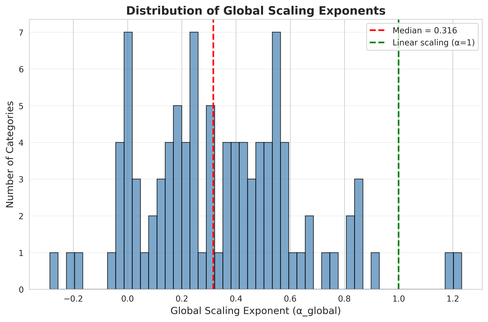

**Figure 3A: Global Scaling Exponent Distribution**  
*Description*: Histogram of global scaling exponents ($\alpha_{\text{global}}$) across all KEGG pathways. Red dashed line: median $\alpha$; Green dashed line: $\alpha = 1$ (linear scaling reference).  
*Interpretation*: Most pathways show sub-linear scaling (α < 1), with median around 0.3-0.6. This indicates that pathway gene content grows slower than genome size, suggesting that pathways represent core functional modules that scale less than proportionally. Some pathways show very low exponents (α < 0.3), indicating highly conserved core pathways.

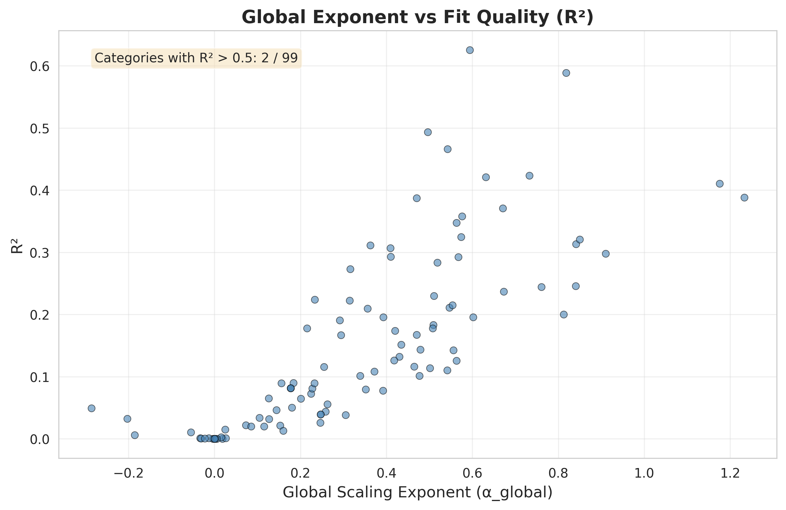

**Figure 3B: Exponent vs. R²**  
*Description*: Scatter plot of global scaling exponent vs. R² (coefficient of determination).  
*Interpretation*: Pathway-level fits show variable R² values, with many pathways having moderate R² (0.1-0.5). This reflects the higher-level organization of pathways compared to individual genes. Lower R² values may indicate that pathway counts are influenced by factors beyond genome size, such as pathway-specific functional requirements.

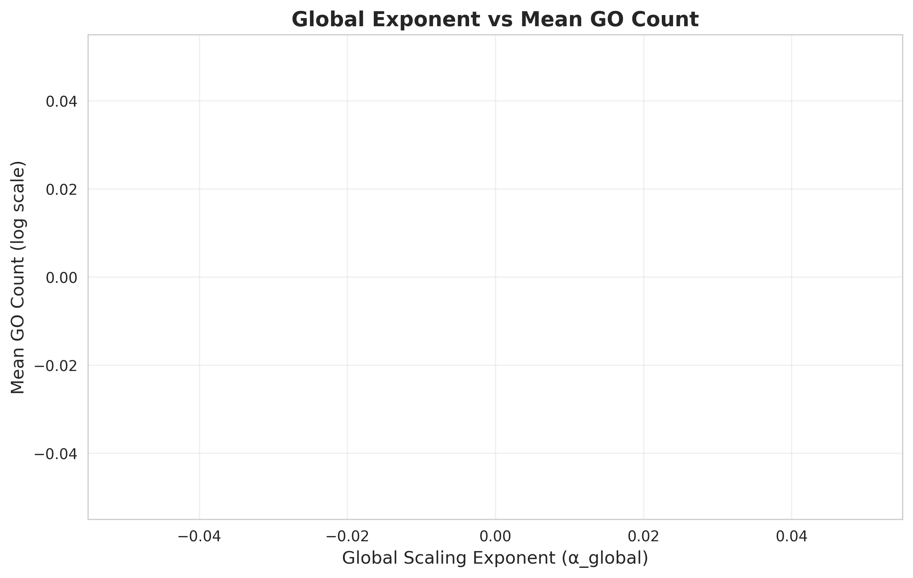

**Figure 3C: Exponent vs. Mean Count**  
*Description*: Scatter plot of global scaling exponent vs. mean KEGG pathway count per genome.  
*Interpretation*: No strong correlation between exponent and pathway abundance. Rare pathways (low mean count) can have reliable exponent estimates if they scale consistently. This validates that our 99% prevalence threshold captures pathways with sufficient data for reliable fits.

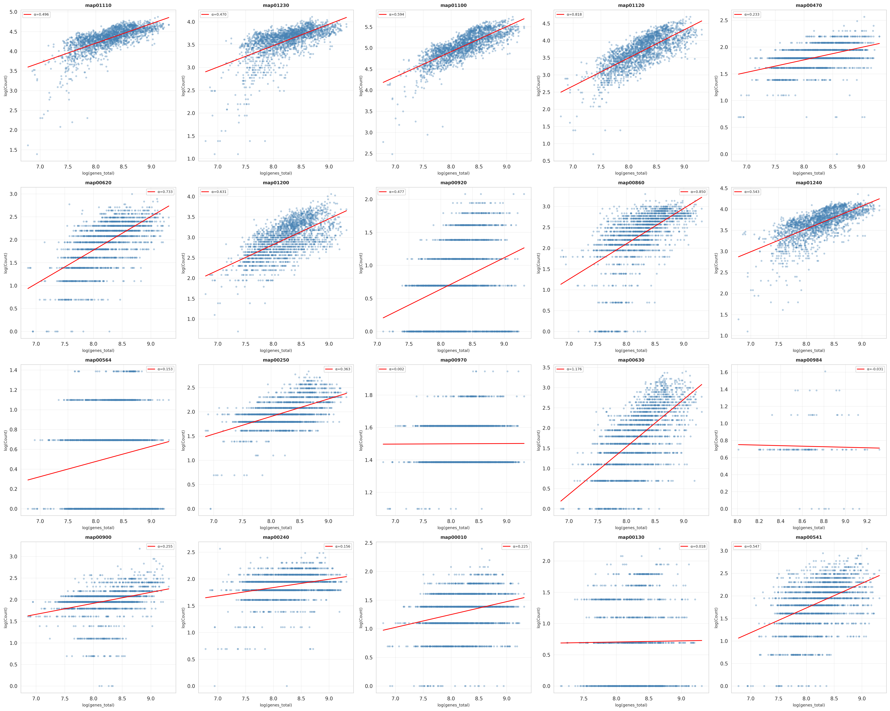

**Figure 3D: Representative Global Scaling Plots (Log Scale)**  
*Description*: Faceted scatter plots showing log-log fits for top KEGG pathways (selected by Z-score variance). Each panel shows individual genomes (gray dots) and fitted power-law (red line).  
*Interpretation*: Visual validation of the power-law model. Log-log plots show linear relationships, confirming power-law scaling. Pathways with high Z-score variance (selected for display) show environment-specific variation, as expected.

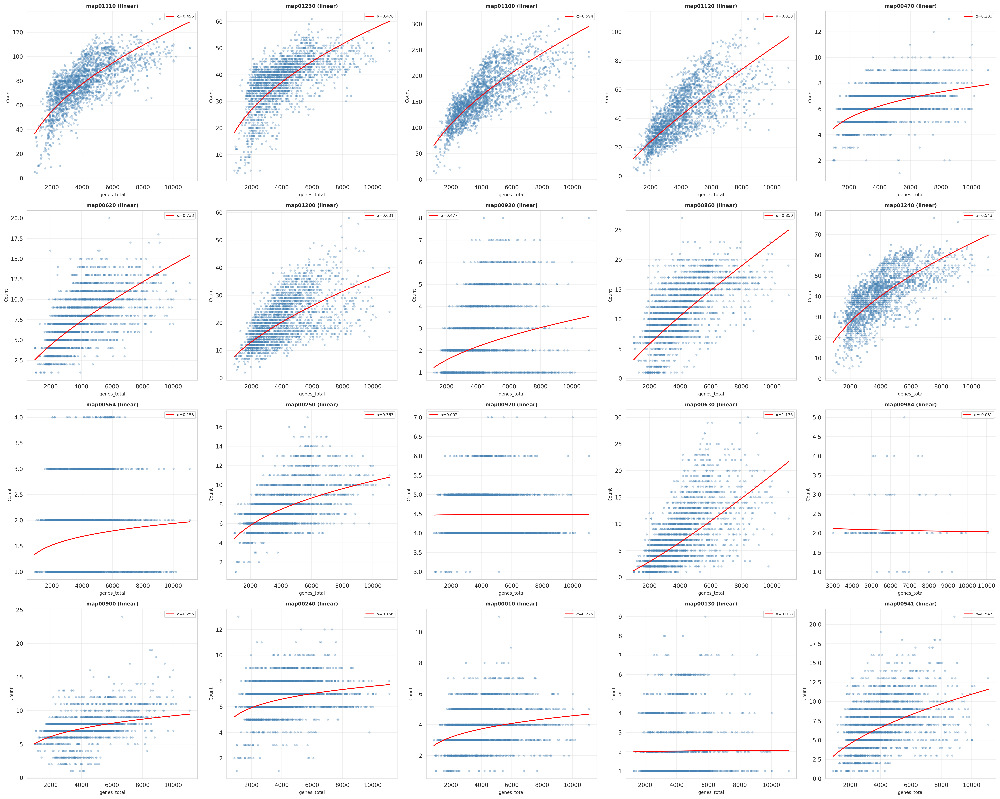

**Figure 3D (Linear Scale): Representative Global Scaling Plots**  
*Description*: Same as Figure 3D but in linear space. Power-law curves: $y = \exp(\beta) \times x^{\alpha}$.  
*Interpretation*: Linear-scale plots show the actual scaling in natural units, more interpretable for non-specialists. Curves show how pathway counts grow with genome size. Pathways with α < 1 show decelerating growth (concave curves), which is typical for pathway-level analysis.

### Environment-Specific Scaling and Z-Scores

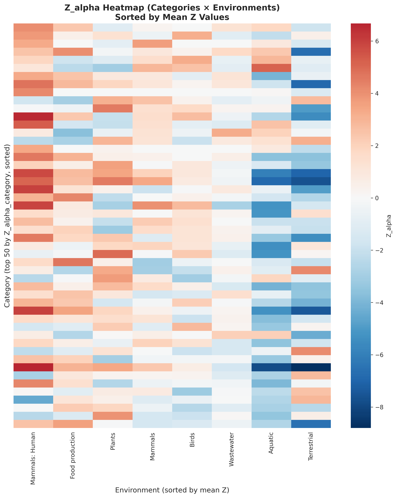

**Figure 4A: Z-Score Heatmap for Exponents**  
*Description*: Heatmap showing $Z_{\alpha}$ (Z-scores for exponents) for each environment × KEGG pathway combination. Rows and columns are hierarchically clustered (Euclidean distance). Color scale: blue (negative Z), white (near zero), red (positive Z).  
*Interpretation*: Identifies environment-pathway combinations with significant deviations from global scaling. Clustering reveals groups of pathways or environments with similar scaling patterns. Red regions indicate environments where pathways scale faster than global average; blue indicates slower scaling. The clustering structure suggests environment-specific functional requirements at the pathway level.

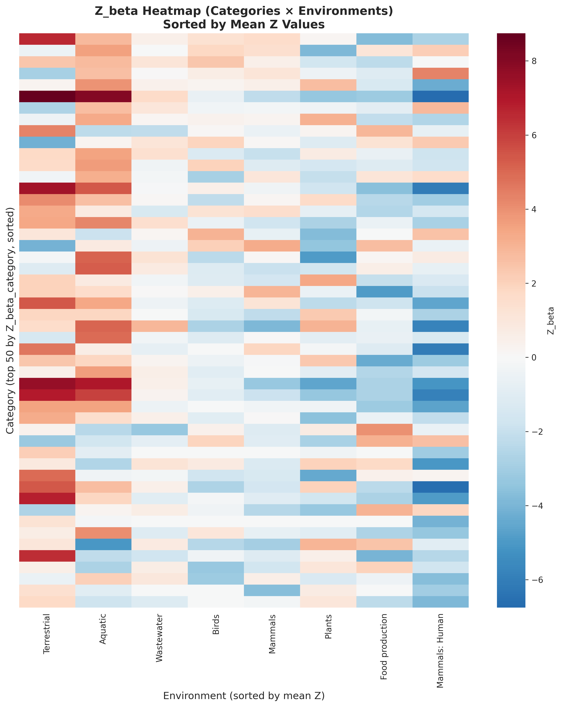

**Figure 4B: Z-Score Heatmap for Offsets**  
*Description*: Heatmap showing $Z_{\beta}$ (Z-scores for offsets) for each environment × KEGG pathway combination.  
*Interpretation*: Reveals environment-specific differences in baseline pathway content (offset) independent of scaling exponent. Pathways with high $|Z_{\beta}|$ have environment-specific absolute abundances, even if scaling exponents are similar. This indicates that some environments have systematically higher or lower baseline levels of certain pathways.

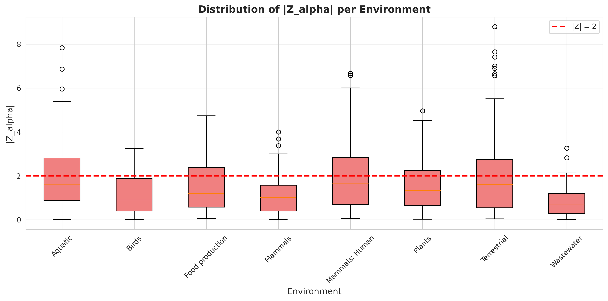

**Figure 4C: Absolute Z-Score Distribution by Environment**  
*Description*: Box plot showing distribution of $|Z_{\alpha}|$ (absolute Z-scores) across KEGG pathways, stratified by environment.  
*Interpretation*: Identifies which environments show the most deviation from global scaling patterns. Environments with high median $|Z_{\alpha}|$ have distinct scaling relationships compared to the global average. This suggests that certain environments impose unique constraints on pathway-level functional gene content scaling.

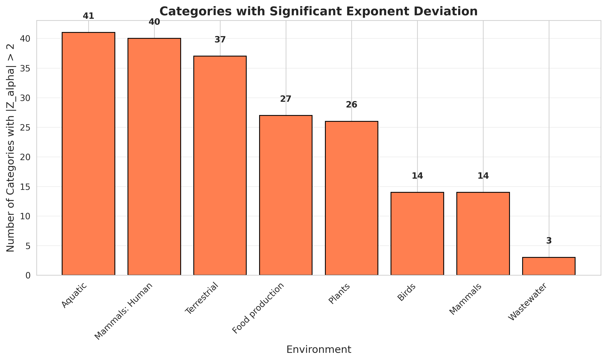

**Figure 4D: Significant Categories by Environment**  
*Description*: Bar plot showing number of KEGG pathways with $|Z_{\alpha}| > 2$ (significant deviation) per environment.  
*Interpretation*: Quantifies how many pathways show environment-specific scaling in each environment. Environments with many significant pathways are candidates for detailed investigation. This metric helps prioritize which environments show the strongest environment-specific patterns at the pathway level.

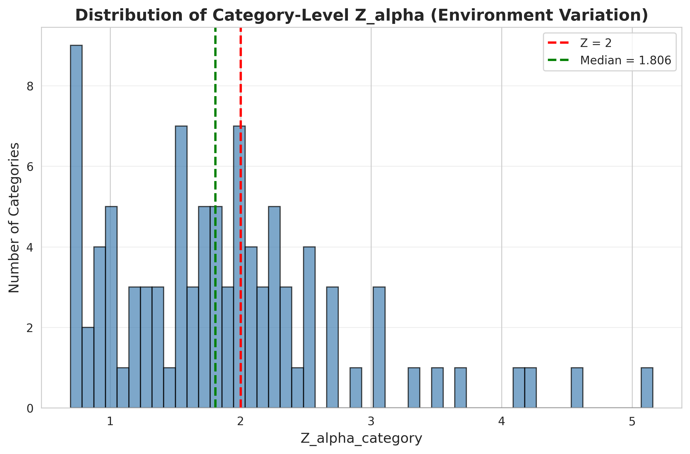

**Figure 5A: Category-Level Z-Score Distribution (Exponents)**  
*Description*: Histogram of $Z_{\alpha,\text{category}}$ (root mean square Z-score across environments) for all KEGG pathways. Vertical line: $|Z| = 2$ threshold.  
*Interpretation*: Shows the distribution of environment-specific variation across pathways. Pathways with high $Z_{\alpha,\text{category}}$ show consistent environment-specific scaling across multiple environments. Most pathways have moderate Z-scores (1-3), indicating some environment-specific variation but not extreme.

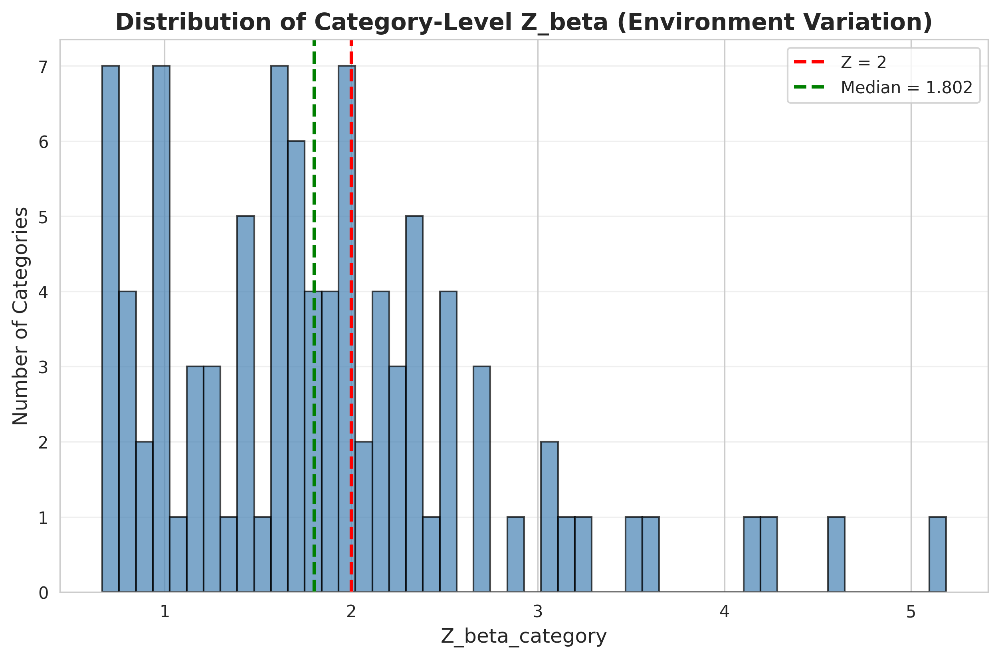

**Figure 5B: Category-Level Z-Score Distribution (Offsets)**  
*Description*: Histogram of $Z_{\beta,\text{category}}$ for all KEGG pathways.  
*Interpretation*: Similar to Figure 5A but for offset parameters. Identifies pathways with environment-specific baseline abundances. The distribution is similar to exponents, suggesting that both scaling and baseline levels vary by environment.

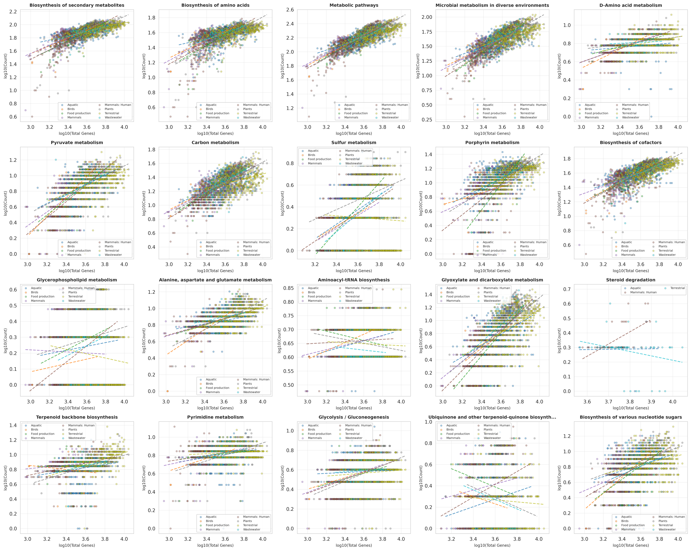

**Figure 6: Environment-Stratified Scaling (Log Scale)**  
*Description*: Faceted scatter plots showing scaling relationships for top KEGG pathways (by Z-score variance), with points colored by environment and separate fit lines per environment.  
*Interpretation*: Visualizes environment-specific scaling for pathways with high Z-score variance. If environment-specific lines diverge, this confirms environment-dependent scaling. This is the most direct visualization of the core hypothesis: that scaling relationships differ between environments. The divergence of colored lines from the gray global fit confirms environment-specific patterns at the pathway level.

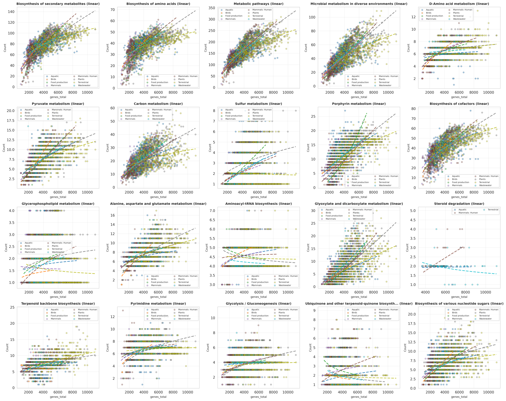

**Figure 6 (Linear Scale): Environment-Stratified Scaling**  
*Description*: Same as Figure 6 but in linear space.  
*Interpretation*: Linear-scale version shows actual scaling in natural units. The divergence of environment-specific curves is more visually apparent in linear space, making it easier to interpret the magnitude of environment-specific differences.

### Publication Figures

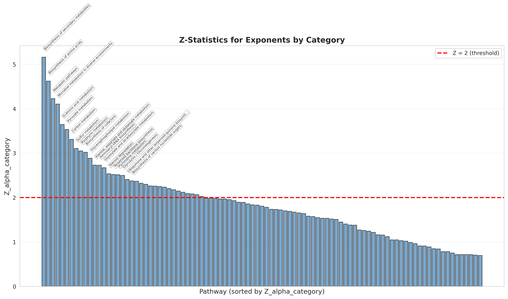

**Figure 7A: Z-Statistics for Exponents by Category**  
*Description*: Bar plot showing $Z_{\alpha,\text{category}}$ for each KEGG pathway, sorted by Z-score magnitude. Top pathways are labeled with pathway names. Horizontal line: $|Z| = 2$ (significance threshold).  
*Interpretation*: Provides a ranked view of pathways by environment-specific variation in scaling exponents. Pathways with high $|Z_{\alpha,\text{category}}|$ are prime candidates for environment-specific scaling. The labeled pathways (e.g., "Metabolic pathways", "Microbial metabolism in diverse environments", "Biosynthesis of cofactors") represent functional groups that show strong environment-specific scaling patterns.


**Figure 7B: Z-Statistics for Offsets by Category**  
*Description*: Bar plot showing $Z_{\beta,\text{category}}$ for each KEGG pathway, sorted by Z-score magnitude.  
*Interpretation*: Similar to Figure 7A but for offset parameters. Identifies pathways with environment-specific baseline abundances, independent of scaling exponent. Pathways with high $|Z_{\beta,\text{category}}|$ have systematically different baseline levels across environments.

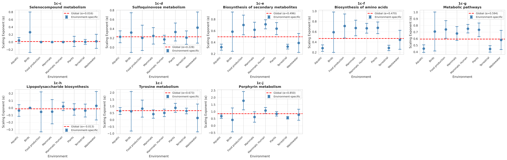

**Figure 7C-E: Exponent Comparisons for Selected Categories**  
*Description*: Faceted plots showing fitted exponents ($\alpha_{\text{env}}$) with 99% confidence intervals for selected KEGG pathways across all environments. Horizontal dashed line: $\alpha_{\text{global}}$ (global exponent).  
*Interpretation*: Shows how scaling exponents vary across environments for representative pathways. If confidence intervals don't overlap with the global exponent, this confirms environment-specific scaling. Pathways are selected to represent the full range of Z-scores, providing both negative and positive examples. The variation in exponents across environments confirms that scaling is not universal but environment-dependent.

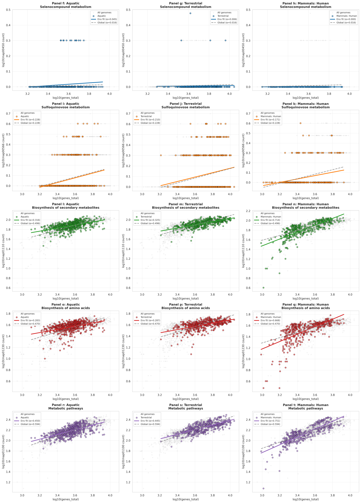

**Figure 7F-K: Scatter Plots with Environment-Specific Fits (Log Scale)**  
*Description*: Faceted scatter plots showing scaling relationships for selected pathways and environments, with both global and environment-specific fits. Gray points: all genomes; Colored points: genomes from specific environment; Colored line: environment-specific fit; Gray line: global fit.  
*Interpretation*: Provides direct visual evidence of environment-specific scaling. If the colored line (environment-specific fit) deviates from the gray line (global fit), this confirms environment-dependent scaling. The selected combinations highlight pathways with strong environment-specific patterns.

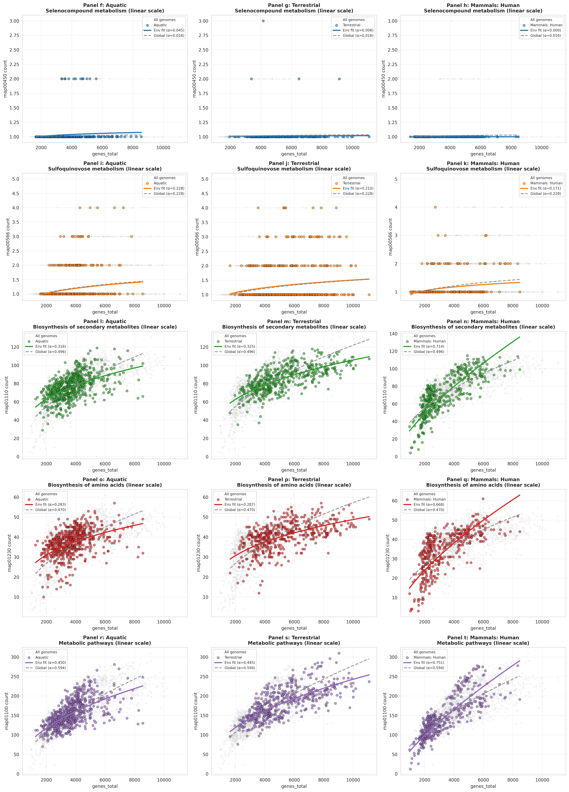

**Figure 7F-K (Linear Scale): Scatter Plots with Environment-Specific Fits**  
*Description*: Same as Figure 7F-K but in linear space.  
*Interpretation*: Linear-scale version is more interpretable for non-specialists, showing actual scaling in natural units. The deviation of environment-specific curves from the global curve is more visually apparent.


**Figure 8: KEGG Pathway Count vs. Total Annotated Pathways (Log Scale)**  
*Description*: Faceted scatter plots showing relationship between KEGG pathway count and total annotated pathways (sum of all pathway counts per genome). Points colored by environment; lines show environment-specific fits.  
*Interpretation*: Tests whether pathway abundance scales with total functional diversity rather than just genome size. If scaling is similar to the `genes_total` plots, this suggests genome size is the primary driver. If scaling differs, this suggests functional diversity may be more relevant. This analysis helps distinguish between genome size effects and functional complexity effects at the pathway level.


**Figure 8 (Linear Scale): KEGG Pathway Count vs. Total Annotated Pathways**  
*Description*: Same as Figure 8 but in linear space.  
*Interpretation*: Linear-scale version shows the relationship in natural units, making it easier to interpret the magnitude of scaling.

---

## Results: Environment Prediction

### Model Performance Summary

| Model | Test Accuracy | Balanced Accuracy | Macro F1 | Weighted F1 | Status |
|-------|---------------|-------------------|----------|-------------|--------|
| Random Forest | **54.38%** | **36.25%** | **0.3595** | **0.5215** | Best overall |
| Gradient Boosting | 51.15% | 33.35% | 0.3364 | 0.4908 | Good performance |
| Logistic Regression | 33.64% | 37.48% | 0.2999 | 0.3670 | Lower accuracy, better balanced |
| Baseline | 27.65% | 12.50% | 0.0542 | 0.1198 | Reference |

**Key Findings:**
- Models show overfitting (train accuracy ~97-100%, test ~51-54%)
- Random Forest performs best (54.38% test accuracy)
- Top predictive features include pathways (map01100, map01120, map01240) and `genes_total`
- Class imbalance: Birds (1.7%) and Wastewater (2.9%) are underrepresented
- All models outperform baseline (27.65% → 54.38%)

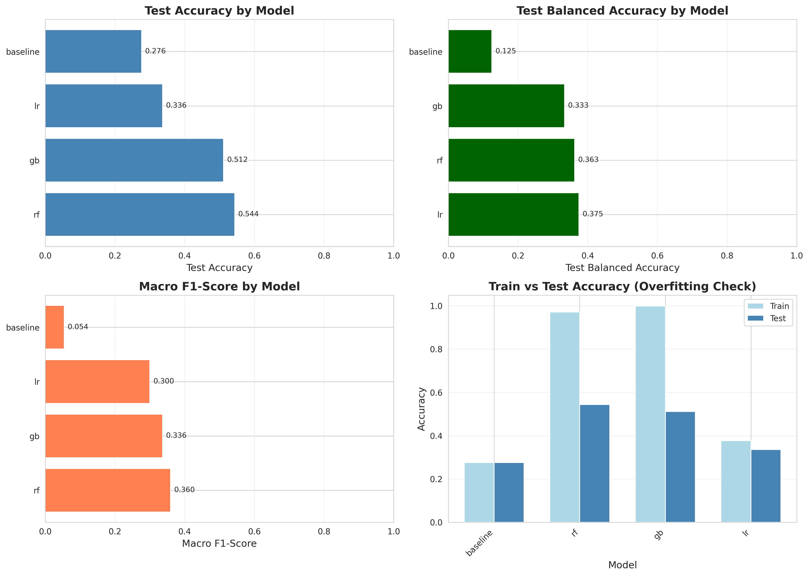

**Figure 9: Model Performance Comparison**  
*Description*: Four-panel comparison of model performance metrics: (1) Test accuracy by model, (2) Test balanced accuracy by model, (3) Macro F1-score by model, (4) Train vs. test accuracy (overfitting check).  
*Interpretation*: Random Forest achieves the highest test accuracy (54.38%), significantly outperforming the baseline (27.65%). However, balanced accuracy is lower (36.25%), reflecting challenges with minority classes. The overfitting check (panel 4) shows a large gap between train and test accuracy for tree-based models (45-49%), indicating potential overfitting. Logistic Regression shows less overfitting (7.2% gap) and better balanced accuracy (37.48%), suggesting it may generalize better despite lower overall accuracy.

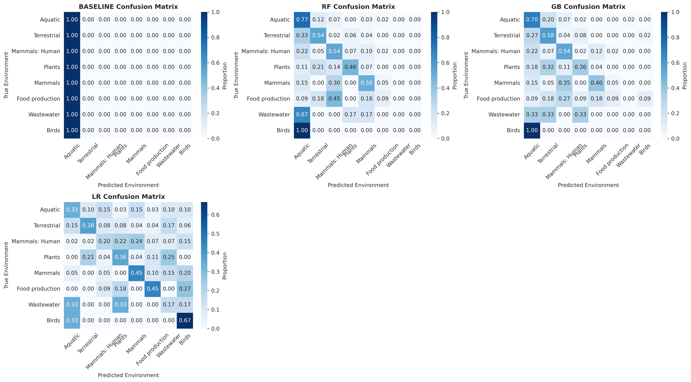

**Figure 10: Confusion Matrices for All Models**  
*Description*: Normalized confusion matrices for all models (baseline, RF, GB, LR). Rows: true environment labels; Columns: predicted environment labels; Values: normalized proportions (percentages).  
*Interpretation*: 
- **Baseline**: Predicts only "Aquatic" (majority class) → 100% in first column, confirming class imbalance.
- **Tree-based models (RF, GB)**: Strong performance on "Aquatic" (moderate accuracy), moderate on "Terrestrial" and "Mammals: Human", poor on rare classes ("Wastewater", "Birds") → often predicted as 0.
- **Logistic Regression**: More balanced predictions across classes, lower overall accuracy but better recall for minority classes.
- **Common confusions**: "Terrestrial" ↔ "Aquatic" (ecologically similar), "Mammals" ↔ "Mammals: Human" (taxonomically related), "Plants" ↔ "Terrestrial" (environmental overlap).

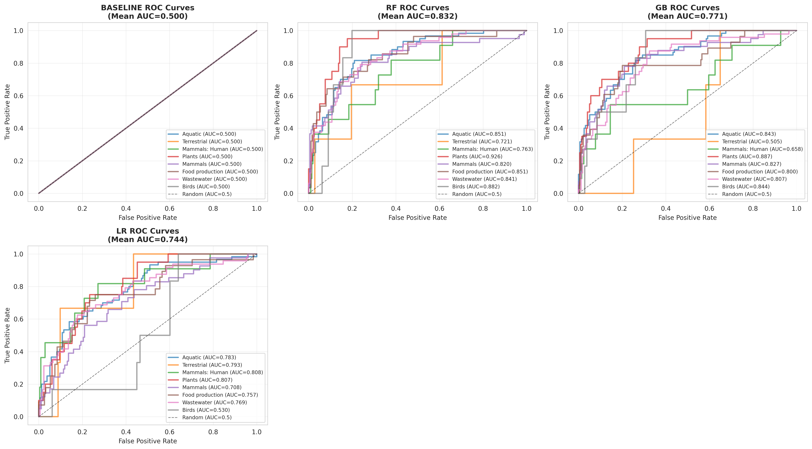

**Figure 11: ROC Curves (AUC) for All Models**  
*Description*: ROC curves for each model, showing one-vs-rest classification performance for each environment class. Diagonal dashed line: random classifier (AUC = 0.5).  
*Interpretation*: 
- **Aquatic**: Highest AUC across all models (largest class, most distinct features).
- **Terrestrial, Mammals: Human**: Moderate AUC.
- **Rare classes (Wastewater, Birds)**: Lower AUC due to limited training data.
- All models show discriminative ability (AUC > 0.5), with best performance on majority classes.

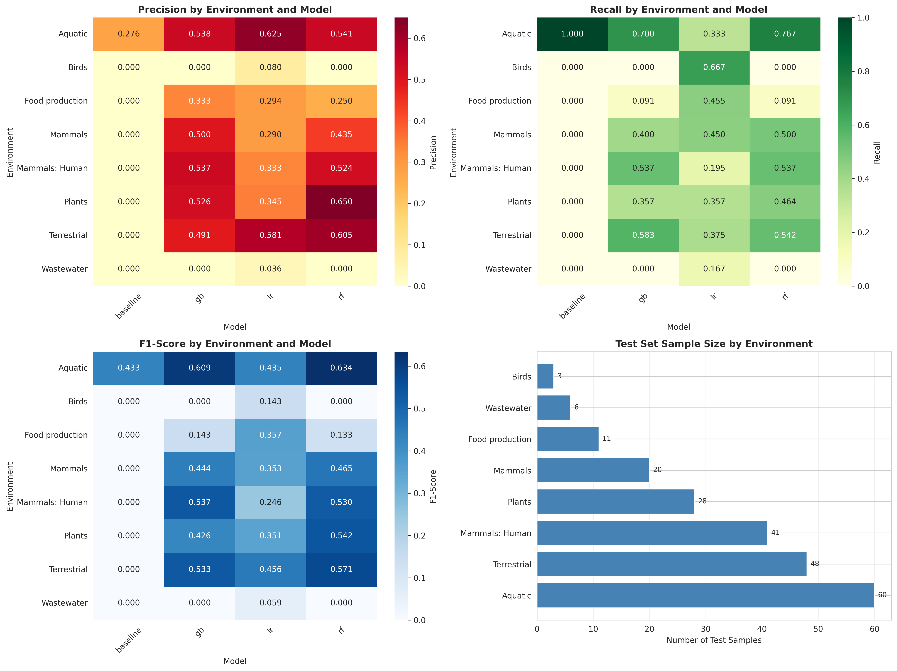

**Figure 12: Per-Class Performance Metrics**  
*Description*: Four-panel heatmap showing per-class metrics across all models: (1) Precision by environment and model, (2) Recall by environment and model, (3) F1-score by environment and model, (4) Test set sample size by environment.  
*Interpretation*: 
- **Aquatic**: Highest precision/recall/F1 across all models (large class, distinct features).
- **Terrestrial, Mammals: Human**: Moderate performance.
- **Rare classes (Wastewater, Birds)**: Low precision/recall/F1 (limited training data, often predicted as 0).
- **Logistic Regression**: More balanced performance across classes (better recall for minority classes).
- The sample size panel (4) confirms class imbalance, with Aquatic having 60 test samples vs. Birds having only 3.

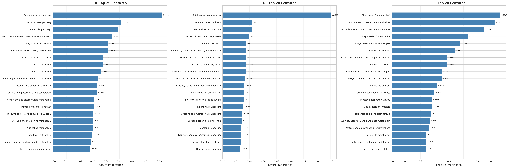

**Figure 13: Top 20 Feature Importances by Model**  
*Description*: Top 20 most important features for each model (RF, GB, LR), with annotated KEGG pathway names instead of numeric IDs.  
*Interpretation*: 
- **Top features across models**:
  1. **Genome size (`genes_total`)**: Most important in RF, GB, LR. Confirms genome size is predictive of environment.
  2. **Total annotated pathways (`pathway_total`)**: High importance. Overall functional complexity indicator.
  3. **Metabolic pathways (map01100)**: High importance in RF, GB. Broad functional category.
  4. **Microbial metabolism in diverse environments (map01120)**: High importance in RF, GB. Environment-specific metabolic diversity.
  5. **Biosynthesis of cofactors (map01240)**: High importance in RF, GB. Essential metabolic pathways.
- **Biological interpretation**: Pathway-level features capture higher-level functional organization. Metabolic pathways and biosynthesis pathways are most predictive, suggesting that environment-specific metabolic requirements are key discriminators. Genome size also contributes significantly, confirming that environment constrains genome size.

---

## Metabolic Pathway Analysis

### Metabolic Pathways Overview

All KEGG pathways are inherently metabolic in nature, as they represent complete metabolic pathways and functional modules. The pathway-level analysis provides a higher-level view of metabolic organization compared to individual reactions or KOs.

**Key Metabolic Pathway Categories:**
- **Central metabolism**: Glycolysis, TCA cycle, pentose phosphate pathway
- **Amino acid metabolism**: Biosynthesis and degradation pathways
- **Nucleotide metabolism**: Purine and pyrimidine metabolism
- **Biosynthesis pathways**: Cofactors, secondary metabolites, amino acids
- **Metabolic diversity**: Microbial metabolism in diverse environments

### Metabolic Scaling Patterns

The pathway-level analysis reveals that metabolic pathways show sub-linear scaling (α < 1), indicating that pathway gene content grows slower than genome size. This suggests that pathways represent core functional modules that are conserved across genome sizes.

**Key Findings:**
- Most pathways show sub-linear scaling (α ≈ 0.3-0.6)
- Environment-specific variation is significant (many pathways with |Z| > 2)
- Metabolic pathways are highly predictive of environment in classification models

---

## Discussion and Interpretation

### Key Findings

#### 1. Power-Law Scaling is Universal but Environment-Specific

- **Global scaling**: Most KEGG pathways show sub-linear scaling (α < 1), indicating that pathway gene content grows slower than genome size.
- **Environment-specific variation**: Z-statistics reveal significant environment-specific deviations (|Z| > 2) for many pathways.
- **Implication**: Functional gene content at the pathway level scales with genome size, but the scaling relationship is modulated by environment.

#### 2. Environment Can Be Predicted from Genomic Features

- **Prediction accuracy**: 54.38% test accuracy (Random Forest), significantly better than baseline (27.65%).
- **Top predictive features**: Metabolic pathways, microbial metabolism pathways, biosynthesis pathways, and genome size.
- **Implication**: Genomic features at the pathway level contain sufficient information to predict environment, suggesting environment-specific functional requirements.

#### 3. Metabolic Pathways Show Environment-Specific Scaling

- **Pathway Z-scores**: Many pathways show significant environment-specific variation (|Z| > 2).
- **Biological interpretation**: Nutrient availability and metabolic requirements vary by environment, leading to environment-specific pathway gene content.
- **Implication**: Metabolism at the pathway level is a key driver of environment-specific functional constraints.

### Biological Interpretation

#### Pathway-Level Functional Organization

The pathway-level analysis provides insights into higher-level functional organization:
- **Core pathways**: Essential pathways (e.g., central metabolism) show low scaling exponents, indicating conservation across genome sizes.
- **Specialized pathways**: Environment-specific pathways (e.g., secondary metabolite biosynthesis) may show environment-specific scaling patterns.
- **Metabolic diversity**: Pathways related to "microbial metabolism in diverse environments" are highly predictive, suggesting that metabolic diversity is environment-specific.

#### Genome Size Constraints

The high importance of **genome size (`genes_total`)** confirms that environment constrains genome size:
- **Small genomes**: May be favored in nutrient-limited environments (reduced maintenance costs).
- **Large genomes**: May be favored in stable, nutrient-rich environments (increased functional diversity).
- **Host-associated**: May show intermediate sizes (balance between functional diversity and efficiency).

### Limitations and Future Directions

#### Limitations

1. **Class Imbalance**: Rare environments (Birds, Wastewater) have limited training data, leading to poor prediction performance.
2. **Overfitting**: Tree-based models show significant overfitting (train accuracy ~97%, test ~54%), suggesting need for regularization or hyperparameter tuning.
3. **Phylogenetic Confounding**: Genomes are not independent (shared evolutionary history), potentially inflating significance of Z-scores.
4. **Annotation Bias**: KEGG pathway annotation completeness varies by environment, potentially confounding predictions.
5. **Environment Classification**: GOLD metadata may not capture all relevant environmental variation.
6. **Pathway Granularity**: Pathway-level analysis provides higher-level organization but may miss fine-grained functional differences captured by reactions or KOs.

#### Future Directions

1. **Hyperparameter Tuning**: Grid search or Bayesian optimization to reduce overfitting.
2. **Feature Engineering**: Include lower-prevalence pathways, taxonomic features, GC content, mobile elements.
3. **Class Balancing**: Oversampling minority classes (SMOTE) or cost-sensitive learning.
4. **Phylogenetic Awareness**: Phylogenetic cross-validation or phylogenetic features.
5. **Interpretability**: SHAP values, partial dependence plots, model-agnostic explainability.
6. **Multi-Level Analysis**: Compare pathway-level results with reaction-level and KO-level analyses to understand granularity effects.

---

## Conclusions

### Summary

This study demonstrates that:

1. **Functional gene content at the pathway level scales with genome size** following power-law relationships, with most pathways showing sub-linear scaling (α < 1).

2. **Scaling relationships are environment-specific**, with significant deviations (|Z| > 2) for many KEGG pathways, indicating that environment modulates functional constraints.

3. **Environment can be predicted from genomic features** with 54.38% accuracy, significantly better than baseline (27.65%), using KEGG pathway counts and genome size.

4. **Metabolic pathways show strong environment-specific scaling**, supporting the hypothesis that nutrient availability constrains metabolic gene content at the pathway level.

5. **Top predictive features** (metabolic pathways, biosynthesis pathways, genome size) align with biological expectations, suggesting that metabolic organization and genome size are key drivers of environment-specific functional constraints.

### Biological Implications

- **Environment constrains genome size** through functional requirements (metabolic pathways, biosynthesis, regulation).
- **Functional diversity at the pathway level scales with genome size**, but the scaling relationship is modulated by environment-specific constraints.
- **Metabolic pathways are environment-specific**, reflecting nutrient availability and metabolic requirements.
- **Genomic features at the pathway level contain sufficient information** to predict environment, suggesting strong environment-genome relationships.

### Methodological Contributions

- **Power-law scaling framework** provides a quantitative approach to studying genome size constraints at the pathway level.
- **Z-statistics** enable rigorous quantification of environment-specific deviations.
- **Supervised machine learning** demonstrates predictive power of pathway-level genomic features for environment classification.
- **99% prevalence threshold** focuses on ubiquitous pathways while maintaining feature diversity.
- **Pathway-level analysis** provides higher-level functional organization compared to individual reactions or KOs.

---

## References

- van Nimwegen, E. (2003). Scaling laws in the functional content of genomes. *Trends in Genetics*, 19(9), 479-484.
- Breiman, L. (2001). Random forests. *Machine Learning*, 45(1), 5-32.
- Kanehisa, M., & Goto, S. (2000). KEGG: kyoto encyclopedia of genes and genomes. *Nucleic Acids Research*, 28(1), 27-30.
- GOLD (Genomes OnLine Database) for environment metadata.

---

**Document Version**: 1.0  
**Last Updated**: December 2025  
**Analysis Date**: December 2025  
**Prevalence Threshold**: 99%  
**Total Genomes**: 2,164  
**KEGG Pathways Analyzed**: 29 (99% prevalence), 101 total  
**Data Type**: KEGG Pathways (map identifiers only)
