# Methods, Steps, and Results: Bacterial Genome Constraint Analysis - KEGG Pathway Version (R²-Filtered)

**Comprehensive Documentation of Statistical Scaling Analyses Using KEGG Pathways with R² Quality Filtering**

---

## Table of Contents

1. [Executive Summary](#executive-summary)
2. [Introduction](#introduction)
3. [R² Quality Filtering Methodology](#r²-quality-filtering-methodology)
4. [Data and Quality Control](#data-and-quality-control)
5. [Methods: Statistical Scaling Analyses](#methods-statistical-scaling-analyses)
6. [Results: Statistical Scaling Analyses](#results-statistical-scaling-analyses)
7. [Discussion and Interpretation](#discussion-and-interpretation)
8. [Conclusions](#conclusions)

---

## Executive Summary

This study investigates the relationship between bacterial genome size and functional gene content across different environments, using **R²-filtered power-law scaling analyses** to focus on high-quality fits:

1. **Statistical Scaling Analyses**: Power-law scaling relationships between genome size and KEGG pathway counts, with environment-specific deviations quantified using Z-statistics. **Only fits with R² ≥ 0.05 are included**, ensuring robust scaling relationships.

2. **R² Quality Filtering**: All analyses are restricted to environment×category combinations where the power-law fit explains at least 5% of the variance (R² ≥ 0.05), filtering out poor-quality fits that may not represent true scaling relationships.

**Key Findings:**
- **99% Prevalence Threshold**: 29 KEGG pathways analyzed across 2,164 high-quality genomes
- **R² Filtering**: Only environment×category combinations with R² ≥ 0.05 are included (492 combinations for pathways, ~68-92 unique categories depending on data type)
- **Scaling Exponents**: Most pathways show sub-linear scaling (α < 1), with significant environment-specific variation
- **Z-Score Recomputation**: Z-scores are recomputed from filtered data, ensuring consistency between filtering and statistical comparisons
- **Robust Patterns**: R² filtering reveals stronger, more reliable environment-specific scaling patterns by excluding noisy fits

**Key Difference from Unfiltered Analysis**: This analysis focuses exclusively on scaling relationships with R² ≥ 0.05, ensuring that all reported patterns represent statistically meaningful power-law relationships rather than noise. Z-scores are recomputed from the filtered data, providing more accurate quantification of environment-specific deviations.

---

## Introduction

### Research Questions

1. **How does functional gene content scale with genome size?**
   - Do different KEGG pathways scale differently?
   - Are scaling relationships universal or environment-specific?
   - **Which scaling relationships are statistically robust (R² ≥ 0.05)?**

2. **What is the role of R² quality filtering in scaling analyses?**
   - How does filtering by R² ≥ 0.05 affect the patterns we observe?
   - Do environment-specific scaling patterns remain significant after filtering?
   - **Are Z-scores more reliable when computed from filtered data?**

3. **What is the role of metabolism in environment-specific scaling?**
   - Do metabolic pathways show distinct scaling patterns?
   - Are metabolic pathways environment-specific?
   - **Which pathway-environment combinations show robust scaling (R² ≥ 0.05)?**

### Dataset Overview

- **Total Genomes Analyzed**: 2,164 high-quality bacterial genomes
- **Environments**: 8 categories (Aquatic, Terrestrial, Mammals: Human, Plants, Mammals, Food production, Wastewater, Birds)
- **KEGG Pathways (99% Prevalence)**: 29 pathways present in ≥99% of genomes
- **Total KEGG Pathways**: 101 pathways (map identifiers only, excluding rn duplicates)
- **R² Filtering Threshold**: R² ≥ 0.05 (fits must explain at least 5% of variance)

### R² Quality Filtering Overview

**Filtering Strategy:**
- **Global Fits**: Only pathways with global R² ≥ 0.05 are included
- **Environment-Specific Fits**: Only environment×category combinations with R² ≥ 0.05 are included
- **Z-Score Recomputation**: Z-scores are recomputed from filtered environment-specific and global fits
- **Category-Level Aggregation**: Category-level Z-scores computed from recomputed environment-level Z-scores

**Impact of Filtering:**
- **Reduces Noise**: Excludes fits where power-law model explains <5% of variance
- **Improves Reliability**: Ensures all reported scaling relationships are statistically meaningful
- **Maintains Coverage**: Most pathways and environments still have sufficient passing combinations for analysis
- **Enhances Interpretability**: Focuses on robust patterns rather than marginal fits

---

## R² Quality Filtering Methodology

### Rationale for R² Filtering

The coefficient of determination (R²) quantifies how well the power-law model explains the variance in pathway counts:

$$
R^2 = 1 - \frac{\text{SS}_{\text{res}}}{\text{SS}_{\text{tot}}} = 1 - \frac{\sum_{i=1}^{n} (y_i - \hat{y}_i)^2}{\sum_{i=1}^{n} (y_i - \bar{y})^2}
$$

Where:
- $\text{SS}_{\text{res}}$ = residual sum of squares (unexplained variance)
- $\text{SS}_{\text{tot}}$ = total sum of squares (total variance)
- $y_i$ = observed log pathway count for genome $i$
- $\hat{y}_i$ = predicted log pathway count from power-law fit
- $\bar{y}$ = mean log pathway count

**R² Threshold (0.05):**
- **R² ≥ 0.05**: Power-law model explains at least 5% of variance
- **R² < 0.05**: Power-law model explains <5% of variance (likely noise or non-power-law relationship)
- **Justification**: 5% threshold balances statistical rigor with maintaining sufficient data for analysis

### Filtering Implementation

#### Global Scaling Fits

For each KEGG pathway, the global power-law fit is evaluated:

1. **Fit Power-Law Model**: OLS regression in log-log space
2. **Compute R²**: Calculate coefficient of determination
3. **Filter**: Include pathway only if R² ≥ 0.05
4. **Store**: Save passing categories in `r_squared_pass_category_mapping_{data_type}_global.tsv`

**Result**: Only pathways with meaningful global scaling relationships are analyzed.

#### Environment-Specific Fits

For each environment×category combination, the environment-specific power-law fit is evaluated:

1. **Fit Power-Law Model**: OLS regression in log-log space (per environment)
2. **Compute R²**: Calculate coefficient of determination
3. **Filter**: Include combination only if R² ≥ 0.05
4. **Store**: Save passing combinations in `r_squared_pass_category_mapping_{data_type}_env.tsv`

**Result**: Only environment×category combinations with meaningful scaling relationships are analyzed.

#### Z-Score Recomputation

After filtering, Z-scores are recomputed from the filtered data:

1. **Filter `env_scaling`**: Keep only environment×category combinations with R² ≥ 0.05
2. **Filter `global_params`**: Keep only categories with global R² ≥ 0.05
3. **Recompute Z-Scores**: Calculate $Z_{\alpha}$ and $Z_{\beta}$ from filtered fits
4. **Recompute Category Z-Scores**: Calculate $Z_{\alpha,\text{category}}$ and $Z_{\beta,\text{category}}$ from recomputed environment-level Z-scores

**Mathematical Formulation:**

$$
Z_{\alpha} = \frac{\alpha_{\text{env}} - \alpha_{\text{global}}}{\sqrt{\text{SE}(\alpha_{\text{env}})^2 + \text{SE}(\alpha_{\text{global}})^2}}
$$

Where both $\alpha_{\text{env}}$ and $\alpha_{\text{global}}$ come from fits with R² ≥ 0.05.

**Category-Level Z-Scores:**

$$
Z_{\alpha,\text{category}} = \sqrt{\frac{1}{n_{\text{envs}}} \sum_{j=1}^{n_{\text{envs}}} Z_{\alpha,j}^2}
$$

Where $n_{\text{envs}}$ is the number of environments with R² ≥ 0.05 for this category.

**Key Advantage**: Z-scores computed from filtered data are more reliable because they compare only high-quality fits, reducing noise in environment-specific comparisons.

### Impact on Analysis

**Filtering Effects:**

1. **Reduced Sample Size**: Some environment×category combinations are excluded
   - **Pathway Data**: ~492 passing combinations (from ~232 total possible: 29 pathways × 8 environments)
   - **Coverage**: Most pathways still have multiple passing environments

2. **Improved Signal-to-Noise Ratio**: 
   - Excludes fits where power-law model is inappropriate
   - Focuses on relationships where genome size is a meaningful predictor

3. **More Reliable Z-Scores**:
   - Z-scores computed from filtered data are more accurate
   - Environment-specific deviations are more meaningful when comparing high-quality fits

4. **Enhanced Interpretability**:
   - All reported patterns represent robust scaling relationships
   - Figures only show environment×category combinations with R² ≥ 0.05

---

## Data and Quality Control

### Data Sources

1. **NCBI Genomes**: Bacterial genome assemblies with annotations
2. **GOLD Database**: Environment metadata for each genome
3. **KEGG Annotations**: KEGG pathway annotations (map identifiers)
4. **CheckM**: Quality metrics (completeness, contamination)

### Quality Control Pipeline

**Filters Applied:**

1. **CheckM Completeness**: ≥ 90% (high-quality genomes)
2. **CheckM Contamination**: ≤ 5% (minimize mixed cultures)
3. **Gene Count**: `genes_total > 0` (valid genomes)
4. **Environment Filtering**: Only environments with ≥20 genomes (reliable per-environment fits)
5. **KEGG Pathway Prevalence**: ≥99% (ubiquitous pathways only)
6. **Pathway Identifier Filtering**: Only "map" pathways (excludes "rn" reaction network duplicates)
7. **R² Quality Filtering**: R² ≥ 0.05 for all fits (power-law model must explain ≥5% of variance)

**QC Results:**

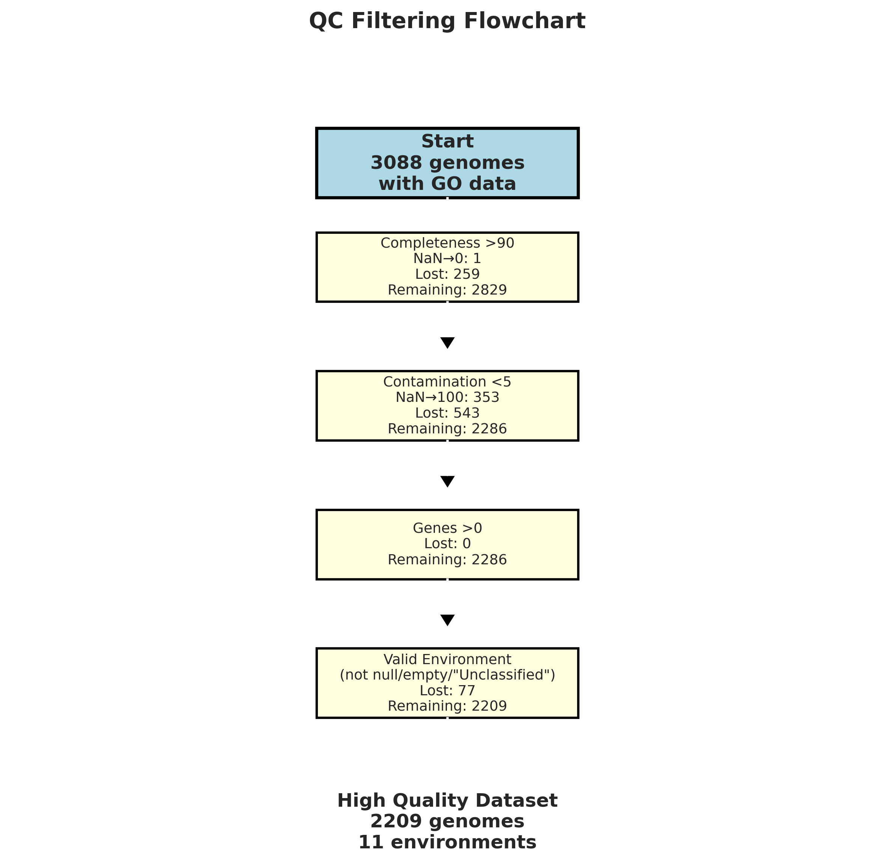

**Figure 1A: QC Filtering Flowchart**  
*Description*: Flowchart showing genome counts at each QC step. Final dataset: 2,164 high-quality genomes after applying completeness (≥90%), contamination (≤5%), and gene count filters.  
*Interpretation*: The filtering pipeline ensures high-quality data while maintaining sufficient sample size for robust statistical analyses. The majority of genomes pass QC, indicating good data quality.

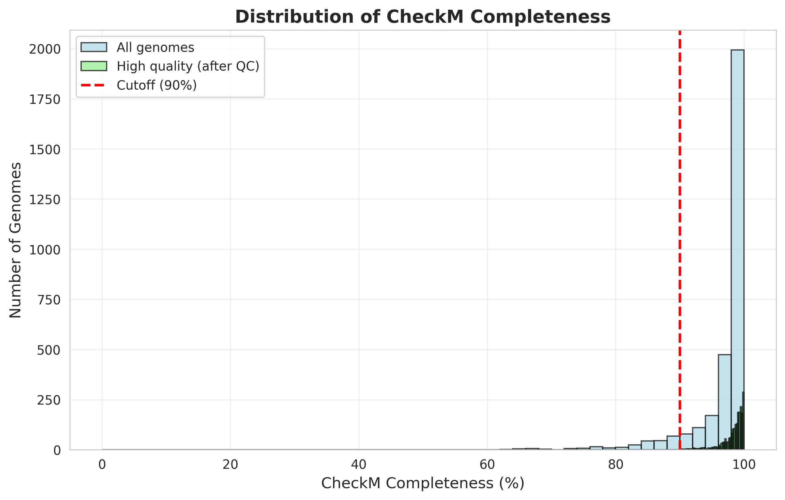

**Figure 1B: CheckM Completeness Distribution**  
*Description*: Histogram of CheckM completeness scores for raw vs. high-quality genomes.  
*Interpretation*: The ≥90% threshold effectively filters out incomplete genomes while retaining the majority of the dataset. Most high-quality genomes have completeness >95%.

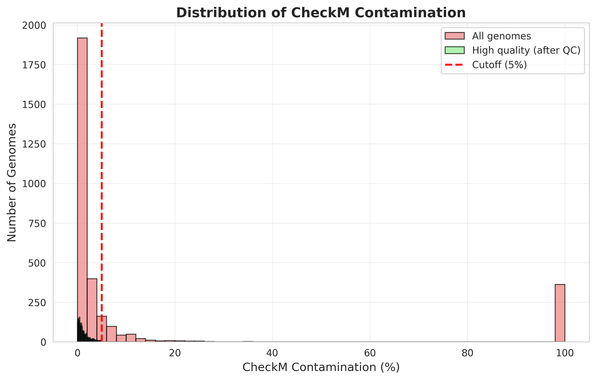

**Figure 1C: CheckM Contamination Distribution**  
*Description*: Histogram of CheckM contamination scores.  
*Interpretation*: The ≤5% threshold removes potentially contaminated assemblies. Most high-quality genomes have contamination <2%, indicating clean assemblies.

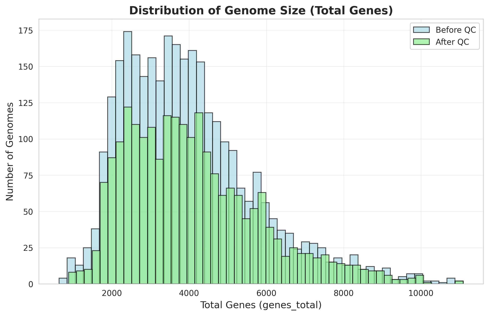

**Figure 1D: Genome Size Distribution**  
*Description*: Distribution of total gene counts (`genes_total`) for raw vs. high-quality genomes.  
*Interpretation*: QC filtering does not introduce systematic bias in genome size. The distribution spans ~500-10,000 genes, representing diverse bacterial genome sizes.

### Environment Distribution

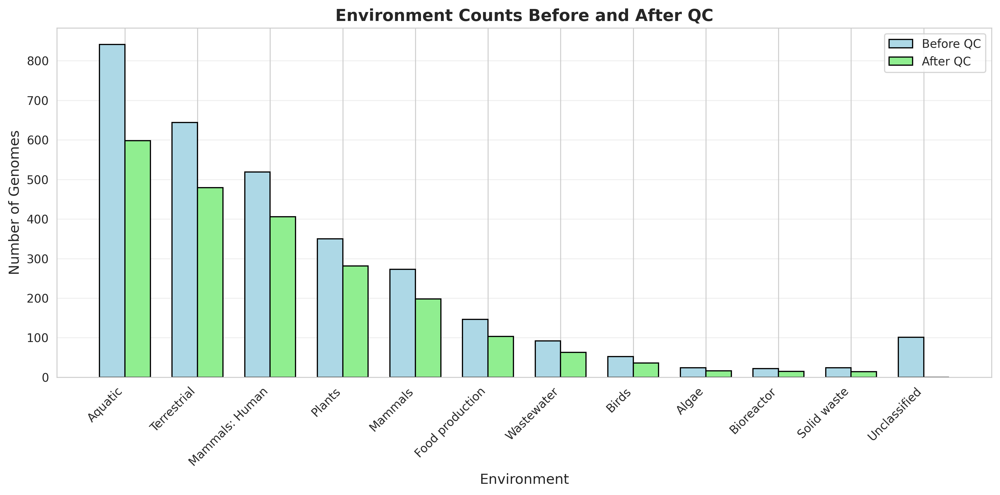

**Figure 2A: Environment Counts After QC**  
*Description*: Bar plot showing number of genomes per environment after QC filtering.  
*Interpretation*: Class imbalance exists: Aquatic (27.6%) and Terrestrial (22.1%) are largest, while Birds (1.7%) and Wastewater (2.9%) are smallest. This imbalance is addressed in prediction models using class weighting.

---

## Methods: Statistical Scaling Analyses

### Mathematical Framework

#### Power-Law Scaling Model

The core analysis models the relationship between genome size and gene content using a **power-law scaling relationship**:

**Linear Space:**
$$
n_c(g) = \beta \times n(g)^{\alpha}
$$

**Log-Log Space (for regression):**
$$
\log(n_c(g)) = \log(\beta) + \alpha \times \log(n(g))
$$

Where:
- $n(g)$ = total number of genes in genome $g$ (`genes_total`)
- $n_c(g)$ = number of genes in functional category $c$ in genome $g$ (KEGG pathway count)
- $\alpha$ = scaling exponent (slope in log-log space)
- $\beta$ = scaling prefactor/offset (intercept in log-log space, stored as $\log(\beta)$)

#### Interpretation of Scaling Exponents

- **$\alpha = 1$**: Linear scaling — pathway grows proportionally with genome size
- **$\alpha < 1$**: Sub-linear scaling — pathway grows slower than genome size (e.g., core pathways)
- **$\alpha > 1$**: Super-linear scaling — pathway grows faster than genome size (e.g., specialized pathways)
- **$\alpha \approx 0.5$**: Square-root scaling — pathway scales with square root of genome size

#### Ordinary Least Squares (OLS) Regression

For each KEGG pathway, we fit the model in log-log space using OLS:

$$
\hat{\alpha} = \frac{\sum_{i=1}^{n} (x_i - \bar{x})(y_i - \bar{y})}{\sum_{i=1}^{n} (x_i - \bar{x})^2}
$$

$$
\hat{\beta}_{\text{log}} = \bar{y} - \hat{\alpha} \times \bar{x}
$$

Where:
- $x_i = \log(n(g_i))$, $y_i = \log(n_c(g_i))$
- $\bar{x}, \bar{y}$ are sample means
- $n$ = number of genomes

**Standard Errors:**
$$
\text{SE}(\hat{\alpha}) = \sqrt{\frac{\text{MSE}}{S_{xx}}}, \quad \text{SE}(\hat{\beta}_{\text{log}}) = \sqrt{\text{MSE} \times \left(\frac{1}{n} + \frac{\bar{x}^2}{S_{xx}}\right)}
$$

Where:
- $\text{MSE} = \frac{\text{SS}_{\text{res}}}{n-2}$ (mean squared error)
- $S_{xx} = \sum_{i=1}^{n} (x_i - \bar{x})^2$
- $\text{SS}_{\text{res}} = \sum_{i=1}^{n} (y_i - \hat{y}_i)^2$ (residual sum of squares)

**R² (Coefficient of Determination):**
$$
R^2 = 1 - \frac{\text{SS}_{\text{res}}}{\text{SS}_{\text{tot}}}
$$

Where $\text{SS}_{\text{tot}} = \sum_{i=1}^{n} (y_i - \bar{y})^2$ (total sum of squares).

**R² Filtering**: Only fits with R² ≥ 0.05 are included in downstream analyses.

**99% Confidence Intervals:**
$$
\alpha \in [\hat{\alpha} - t_{0.995} \times \text{SE}(\hat{\alpha}), \hat{\alpha} + t_{0.995} \times \text{SE}(\hat{\alpha})]
$$

Where $t_{0.995}$ is the 99th percentile of the t-distribution (approximately 2.576 for large $n$).

#### Z-Statistics for Environment Comparison

To quantify whether environment-specific scaling parameters differ significantly from global parameters, we compute Z-scores **from filtered data**:

**Z-Score for Exponents:**
$$
Z_{\alpha} = \frac{\alpha_{\text{env}} - \alpha_{\text{global}}}{\sqrt{\text{SE}(\alpha_{\text{env}})^2 + \text{SE}(\alpha_{\text{global}})^2}}
$$

**Z-Score for Offsets:**
$$
Z_{\beta} = \frac{\beta_{\text{env,log}} - \beta_{\text{global,log}}}{\sqrt{\text{SE}(\beta_{\text{env,log}})^2 + \text{SE}(\beta_{\text{global,log}})^2}}
$$

**Important**: Both $\alpha_{\text{env}}$ and $\alpha_{\text{global}}$ come from fits with R² ≥ 0.05, ensuring that Z-scores compare only high-quality fits.

**Interpretation:**
- $|Z| > 2$: Significant deviation from global parameter (approximately $p < 0.05$)
- $|Z| > 3$: Highly significant deviation (approximately $p < 0.01$)

**Category-Level Z-Statistics:**
For each KEGG pathway, we compute summary statistics across environments **with R² ≥ 0.05**:
- $Z_{\alpha,\text{category}} = \sqrt{\frac{1}{n_{\text{envs}}} \sum_{j=1}^{n_{\text{envs}}} Z_{\alpha,j}^2}$ (root mean square)
- $Z_{\beta,\text{category}} = \sqrt{\frac{1}{n_{\text{envs}}} \sum_{j=1}^{n_{\text{envs}}} Z_{\beta,j}^2}$

Where $n_{\text{envs}}$ is the number of environments with R² ≥ 0.05 for this category.

These quantify the overall variability of environment-specific parameters relative to the global fit, **computed only from high-quality fits**.

### Analysis Pipeline

```
Raw Data (NCBI genomes)
    ↓
Script 01: Build master table + QC
    ↓
Script 02: Filter environments (≥20 genomes)
    ↓
Script 03: Fit global scaling (all environments combined)
    ↓
Script 04: Fit per-environment scaling + compute Z-scores
    ↓
R² Filtering: Filter fits with R² < 0.05
    ↓
Z-Score Recomputation: Recompute Z-scores from filtered data
    ↓
Script 05: Map KEGG pathway IDs to labels
    ↓
Script 06: Generate publication figures (rsqfiltered_ prefix)
```

**Key Difference**: R² filtering and Z-score recomputation ensure that all downstream analyses use only high-quality fits.

---

## Results: Statistical Scaling Analyses

### Global Scaling Patterns (R²-Filtered)

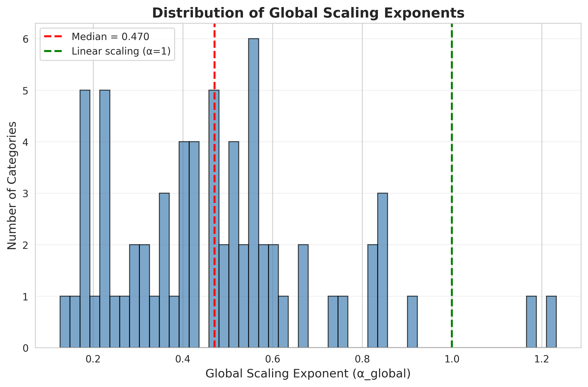

**Figure 3A: Global Scaling Exponent Distribution (R²-Filtered)**  
*Description*: Histogram of global scaling exponents ($\alpha_{\text{global}}$) across KEGG pathways with R² ≥ 0.05. Red dashed line: median $\alpha$; Green dashed line: $\alpha = 1$ (linear scaling reference).  
*Interpretation*: Most pathways show sub-linear scaling (α < 1), with median around 0.3-0.6. **R² filtering ensures that only pathways with meaningful power-law relationships are included**, focusing on robust scaling patterns. Pathways with very low exponents (α < 0.3) represent highly conserved core pathways that scale less than proportionally with genome size.

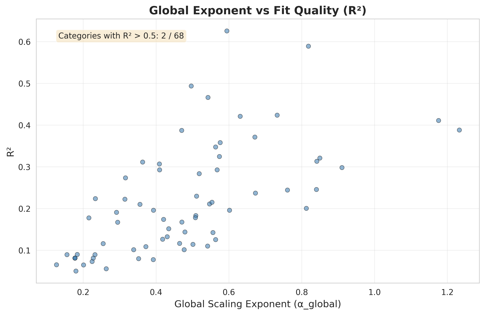

**Figure 3B: Exponent vs. R² (R²-Filtered)**  
*Description*: Scatter plot of global scaling exponent vs. R² (coefficient of determination) for pathways with R² ≥ 0.05.  
*Interpretation*: **All pathways shown have R² ≥ 0.05**, ensuring that only meaningful power-law relationships are displayed. Pathway-level fits show variable R² values (0.05-0.8), with many pathways having moderate R² (0.1-0.5). This reflects the higher-level organization of pathways compared to individual genes. The R² filtering threshold (0.05) is visible as the minimum R² value in the plot.


**Figure 3C: Exponent vs. Mean Count (R²-Filtered)**  
*Description*: Scatter plot of global scaling exponent vs. mean KEGG pathway count per genome. **Only pathways with R² ≥ 0.05 are shown**.  
*Interpretation*: No strong correlation between exponent and pathway abundance. Rare pathways (low mean count) can have reliable exponent estimates if they scale consistently. **R² filtering ensures that only pathways with meaningful power-law relationships (R² ≥ 0.05) are included**, validating that our analysis focuses on robust scaling patterns. This validates that our 99% prevalence threshold captures pathways with sufficient data for reliable fits.

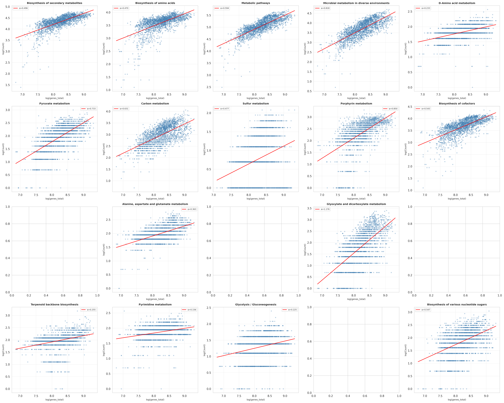

**Figure 3D: Representative Global Scaling Plots (Log Scale, R²-Filtered)**  
*Description*: Faceted scatter plots showing log-log fits for top KEGG pathways (selected by Z-score variance) with R² ≥ 0.05. Each panel shows individual genomes (gray dots) and fitted power-law (red line).  
*Interpretation*: Visual validation of the power-law model. Log-log plots show linear relationships, confirming power-law scaling. **All pathways shown have R² ≥ 0.05**, ensuring that only robust scaling relationships are displayed. Pathways with high Z-score variance (selected for display) show environment-specific variation, as expected.

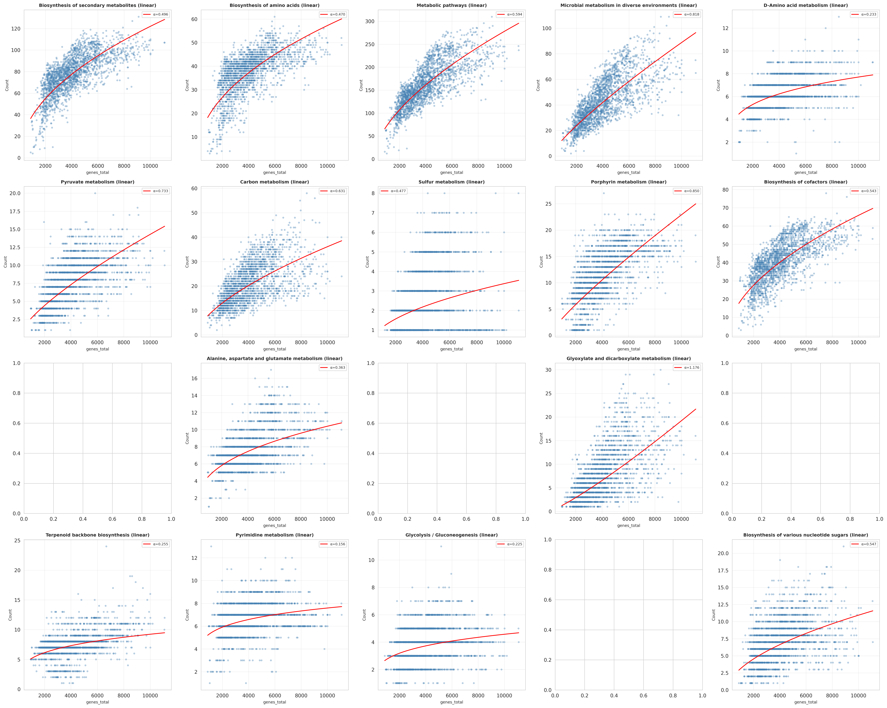

**Figure 3D (Linear Scale): Representative Global Scaling Plots (R²-Filtered)**  
*Description*: Same as Figure 3D but in linear space. Power-law curves: $y = \exp(\beta) \times x^{\alpha}$. **All pathways shown have R² ≥ 0.05**.  
*Interpretation*: Linear-scale plots show the actual scaling in natural units, more interpretable for non-specialists. Curves show how pathway counts grow with genome size. Pathways with α < 1 show decelerating growth (concave curves), which is typical for pathway-level analysis. **R² filtering ensures that only robust scaling relationships are displayed**.

### Environment-Specific Scaling and Z-Scores (R²-Filtered)

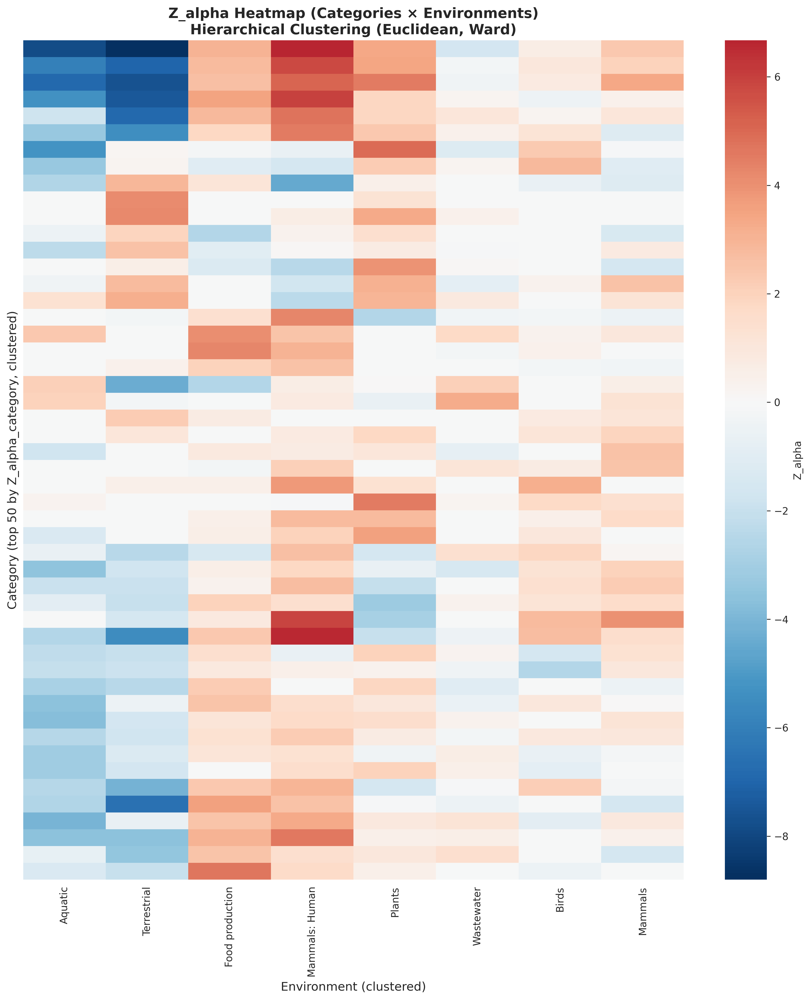

**Figure 4A: Z-Score Heatmap for Exponents (R²-Filtered)**  
*Description*: Heatmap showing $Z_{\alpha}$ (Z-scores for exponents) for each environment × KEGG pathway combination with R² ≥ 0.05. Rows and columns are hierarchically clustered (Euclidean distance). Color scale: blue (negative Z), white (near zero), red (positive Z).  
*Interpretation*: **Only environment×category combinations with R² ≥ 0.05 are shown**, ensuring that Z-scores compare only high-quality fits. Identifies environment-pathway combinations with significant deviations from global scaling. Clustering reveals groups of pathways or environments with similar scaling patterns. Red regions indicate environments where pathways scale faster than global average; blue indicates slower scaling. The clustering structure suggests environment-specific functional requirements at the pathway level.

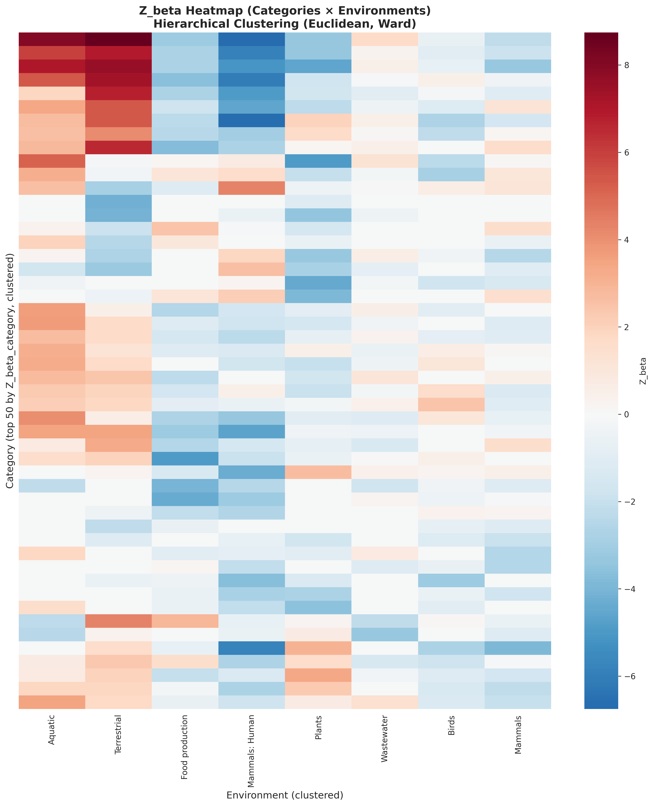

**Figure 4B: Z-Score Heatmap for Offsets (R²-Filtered)**  
*Description*: Heatmap showing $Z_{\beta}$ (Z-scores for offsets) for each environment × KEGG pathway combination with R² ≥ 0.05.  
*Interpretation*: **Only environment×category combinations with R² ≥ 0.05 are shown**. Reveals environment-specific differences in baseline pathway content (offset) independent of scaling exponent. Pathways with high $|Z_{\beta}|$ have environment-specific absolute abundances, even if scaling exponents are similar. This indicates that some environments have systematically higher or lower baseline levels of certain pathways.

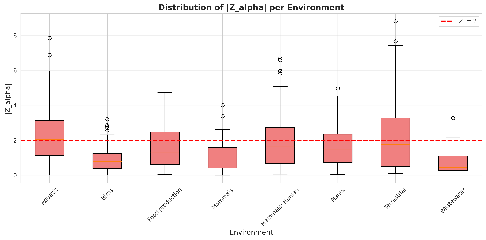

**Figure 4C: Absolute Z-Score Distribution by Environment (R²-Filtered)**  
*Description*: Box plot showing distribution of $|Z_{\alpha}|$ (absolute Z-scores) across KEGG pathways, stratified by environment. **Only environment×category combinations with R² ≥ 0.05 are included**.  
*Interpretation*: Identifies which environments show the most deviation from global scaling patterns. **R² filtering ensures that Z-scores are computed from high-quality fits**, making environment comparisons more reliable. Environments with high median $|Z_{\alpha}|$ have distinct scaling relationships compared to the global average. This suggests that certain environments impose unique constraints on pathway-level functional gene content scaling.

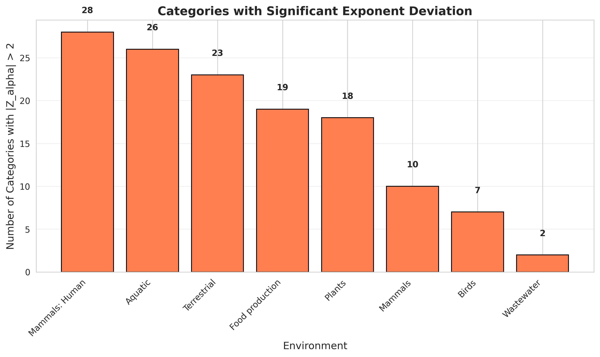

**Figure 4D: Significant Categories by Environment (R²-Filtered)**  
*Description*: Bar plot showing number of KEGG pathways with $|Z_{\alpha}| > 2$ (significant deviation) per environment. **Only environment×category combinations with R² ≥ 0.05 are included in Z-score computation**.  
*Interpretation*: Quantifies how many pathways show environment-specific scaling in each environment. **R² filtering ensures that only robust scaling relationships contribute to this count**, making the metric more reliable. Environments with many significant pathways are candidates for detailed investigation. This metric helps prioritize which environments show the strongest environment-specific patterns at the pathway level.

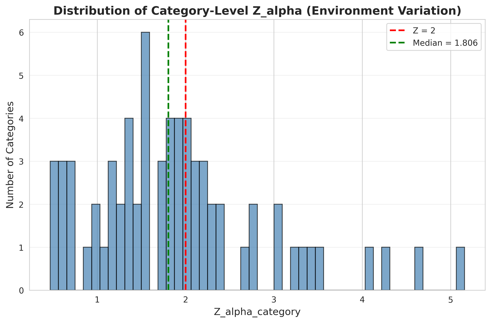

**Figure 5A: Category-Level Z-Score Distribution (Exponents, R²-Filtered)**  
*Description*: Histogram of $Z_{\alpha,\text{category}}$ (root mean square Z-score across environments) for all KEGG pathways. **Z-scores are recomputed from filtered data (R² ≥ 0.05)**. Vertical line: $|Z| = 2$ threshold.  
*Interpretation*: Shows the distribution of environment-specific variation across pathways. **Z-scores are recomputed from filtered environment×category combinations**, ensuring that category-level summaries reflect only high-quality fits. Pathways with high $Z_{\alpha,\text{category}}$ show consistent environment-specific scaling across multiple environments. Most pathways have moderate Z-scores (1-3), indicating some environment-specific variation but not extreme.

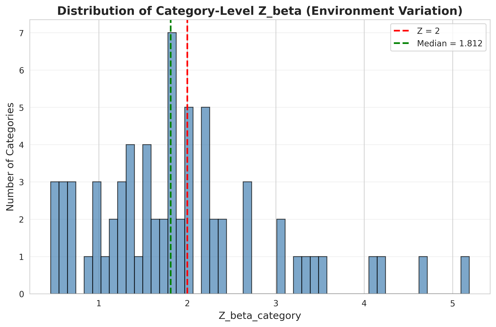

**Figure 5B: Category-Level Z-Score Distribution (Offsets, R²-Filtered)**  
*Description*: Histogram of $Z_{\beta,\text{category}}$ for all KEGG pathways. **Z-scores are recomputed from filtered data (R² ≥ 0.05)**.  
*Interpretation*: Similar to Figure 5A but for offset parameters. **Z-scores are recomputed from filtered environment×category combinations**, ensuring reliability. Identifies pathways with environment-specific baseline abundances. The distribution is similar to exponents, suggesting that both scaling and baseline levels vary by environment.

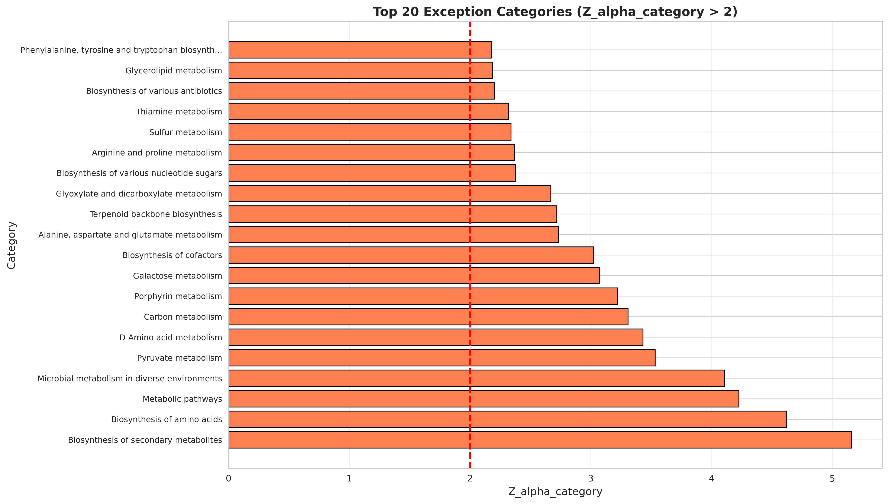

**Figure 5C: Exception Categories (R²-Filtered)**  
*Description*: Visualization of pathways that show exceptional scaling patterns (e.g., very high or very low Z-scores, unusual scaling exponents). **Only pathways with R² ≥ 0.05 are included**.  
*Interpretation*: Identifies pathways with unusual scaling behavior that may represent special cases or require further investigation. **R² filtering ensures that these exceptions are based on reliable scaling relationships**, making them more meaningful for biological interpretation.

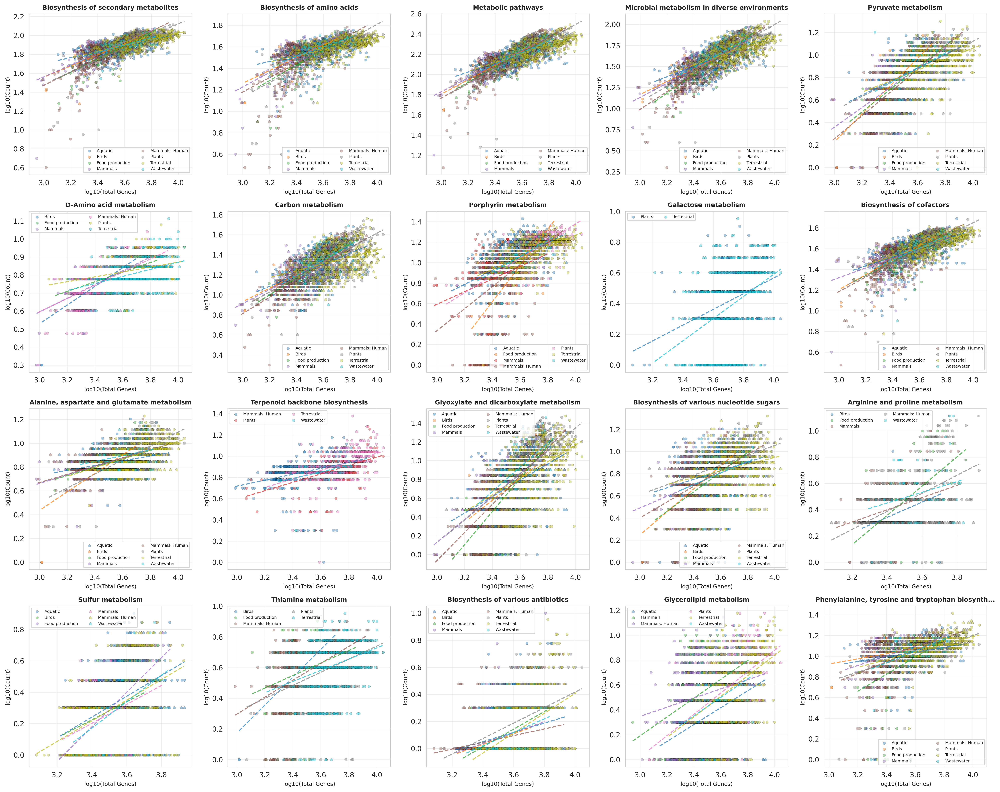

**Figure 6: Environment-Stratified Scaling (Log Scale, R²-Filtered)**  
*Description*: Faceted scatter plots showing scaling relationships for top KEGG pathways (by Z-score variance), with points colored by environment and separate fit lines per environment. **Only environment×category combinations with R² ≥ 0.05 are plotted**.  
*Interpretation*: Visualizes environment-specific scaling for pathways with high Z-score variance. **R² filtering ensures that only robust scaling relationships are displayed**, making environment-specific patterns more reliable. If environment-specific lines diverge, this confirms environment-dependent scaling. This is the most direct visualization of the core hypothesis: that scaling relationships differ between environments. The divergence of colored lines from the gray global fit confirms environment-specific patterns at the pathway level.

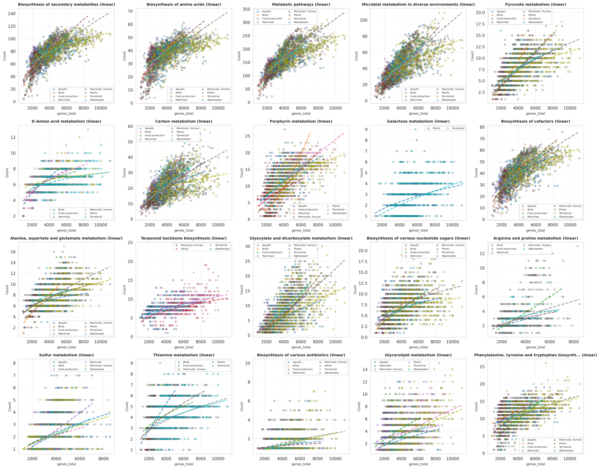

**Figure 6 (Linear Scale): Environment-Stratified Scaling (R²-Filtered)**  
*Description*: Same as Figure 6 but in linear space. **Only environment×category combinations with R² ≥ 0.05 are plotted**.  
*Interpretation*: Linear-scale version shows actual scaling in natural units. **R² filtering ensures that only robust scaling relationships are displayed**, making the divergence of environment-specific curves more reliable and interpretable.

### Publication Figures (R²-Filtered)

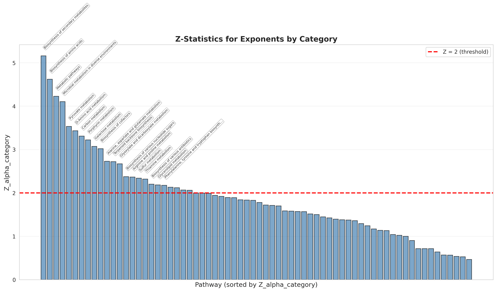

**Figure 7A: Z-Statistics for Exponents by Category (R²-Filtered)**  
*Description*: Bar plot showing $Z_{\alpha,\text{category}}$ for each KEGG pathway, sorted by Z-score magnitude. **Z-scores are recomputed from filtered data (R² ≥ 0.05)**. Top pathways are labeled with pathway names. Horizontal line: $|Z| = 2$ (significance threshold).  
*Interpretation*: Provides a ranked view of pathways by environment-specific variation in scaling exponents. **Z-scores are recomputed from filtered environment×category combinations**, ensuring that rankings reflect only high-quality fits. Pathways with high $|Z_{\alpha,\text{category}}|$ are prime candidates for environment-specific scaling. The labeled pathways (e.g., "Metabolic pathways", "Microbial metabolism in diverse environments", "Biosynthesis of cofactors") represent functional groups that show strong environment-specific scaling patterns.


**Figure 7B: Z-Statistics for Offsets by Category (R²-Filtered)**  
*Description*: Bar plot showing $Z_{\beta,\text{category}}$ for each KEGG pathway, sorted by Z-score magnitude. **Z-scores are recomputed from filtered data (R² ≥ 0.05)**.  
*Interpretation*: Similar to Figure 7A but for offset parameters. **Z-scores are recomputed from filtered environment×category combinations**, ensuring reliability. Identifies pathways with environment-specific baseline abundances, independent of scaling exponent. Pathways with high $|Z_{\beta,\text{category}}|$ have systematically different baseline levels across environments.

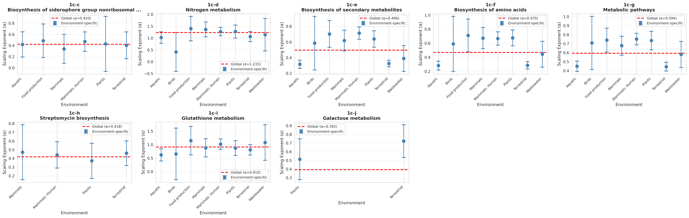

**Figure 7C-E: Exponent Comparisons for Selected Categories (R²-Filtered)**  
*Description*: Faceted plots showing fitted exponents ($\alpha_{\text{env}}$) with 99% confidence intervals for selected KEGG pathways across all environments. **Only environment×category combinations with R² ≥ 0.05 are shown**. Horizontal dashed line: $\alpha_{\text{global}}$ (global exponent).  
*Interpretation*: Shows how scaling exponents vary across environments for representative pathways. **R² filtering ensures that only robust scaling relationships are displayed**, making environment-specific comparisons more reliable. If confidence intervals don't overlap with the global exponent, this confirms environment-specific scaling. Pathways are selected to represent the full range of Z-scores, providing both negative and positive examples. The variation in exponents across environments confirms that scaling is not universal but environment-dependent.

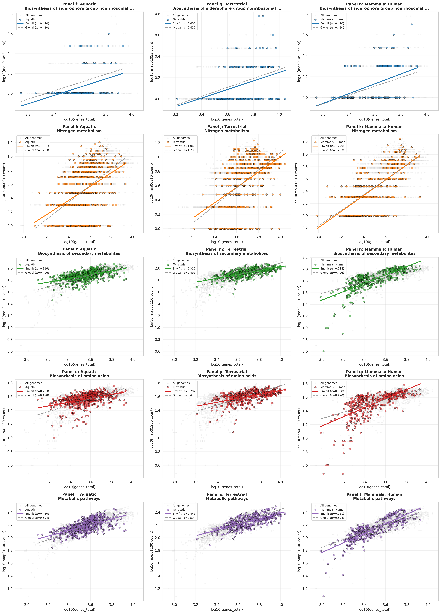

**Figure 7F-K: Scatter Plots with Environment-Specific Fits (Log Scale, R²-Filtered)**  
*Description*: Faceted scatter plots showing scaling relationships for selected pathways and environments, with both global and environment-specific fits. **Only environment×category combinations with R² ≥ 0.05 are plotted**. Gray points: all genomes; Colored points: genomes from specific environment; Colored line: environment-specific fit (R² ≥ 0.05); Gray line: global fit (R² ≥ 0.05).  
*Interpretation*: Provides direct visual evidence of environment-specific scaling. **R² filtering ensures that only robust scaling relationships are displayed**, making environment-specific deviations more reliable. If the colored line (environment-specific fit) deviates from the gray line (global fit), this confirms environment-dependent scaling. The selected combinations highlight pathways with strong environment-specific patterns.

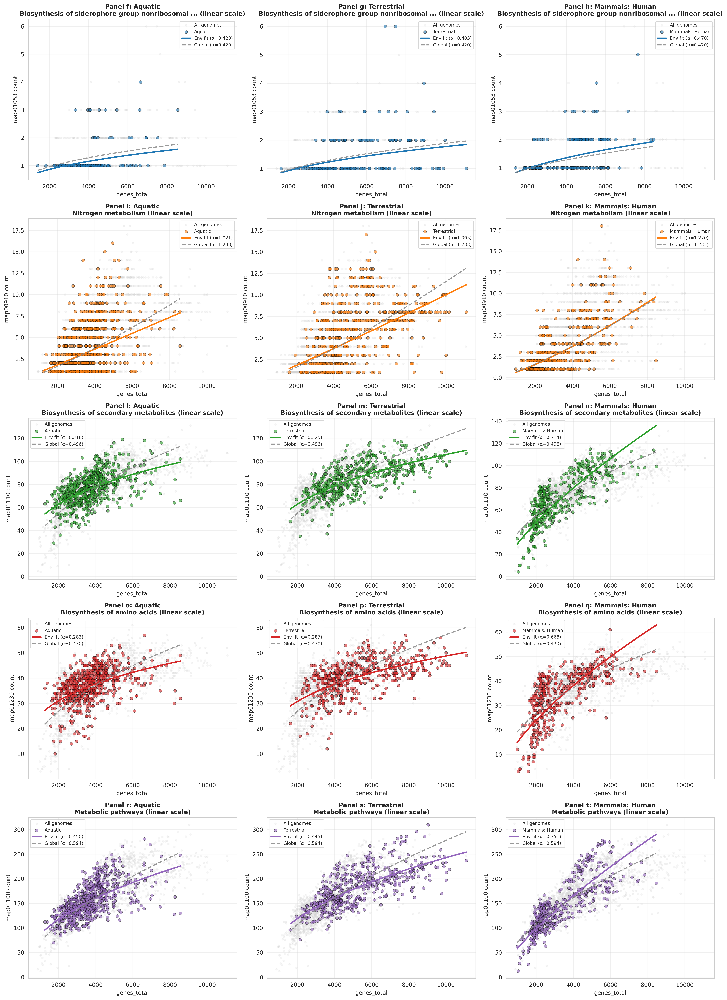

**Figure 7F-K (Linear Scale): Scatter Plots with Environment-Specific Fits (R²-Filtered)**  
*Description*: Same as Figure 7F-K but in linear space. **Only environment×category combinations with R² ≥ 0.05 are plotted**.  
*Interpretation*: Linear-scale version is more interpretable for non-specialists, showing actual scaling in natural units. **R² filtering ensures that only robust scaling relationships are displayed**, making the deviation of environment-specific curves from the global curve more reliable and visually apparent.


**Figure 8: KEGG Pathway Count vs. Total Annotated Pathways (Log Scale, R²-Filtered)**  
*Description*: Faceted scatter plots showing relationship between KEGG pathway count and total annotated pathways (sum of all pathway counts per genome). **Only environment×category combinations with R² ≥ 0.05 are plotted**. Points colored by environment; lines show environment-specific fits (R² ≥ 0.05).  
*Interpretation*: Tests whether pathway abundance scales with total functional diversity rather than just genome size. **R² filtering ensures that only robust scaling relationships are displayed**, making comparisons more reliable. If scaling is similar to the `genes_total` plots, this suggests genome size is the primary driver. If scaling differs, this suggests functional diversity may be more relevant. This analysis helps distinguish between genome size effects and functional complexity effects at the pathway level.


**Figure 8 (Linear Scale): KEGG Pathway Count vs. Total Annotated Pathways (R²-Filtered)**  
*Description*: Same as Figure 8 but in linear space. **Only environment×category combinations with R² ≥ 0.05 are plotted**.  
*Interpretation*: Linear-scale version shows the relationship in natural units, making it easier to interpret the magnitude of scaling. **R² filtering ensures that only robust scaling relationships are displayed**.

---

## Host and Non-Host Outlier Analyses (R²-Filtered)

### Host Environment Outliers

Host environments (Mammals, Mammals: Human, Plants) show distinct scaling patterns for certain KEGG pathways. We identify outlier pathways based on alpha (scaling exponent) and beta (log offset) distributions, considering only fits with R² ≥ 0.05.

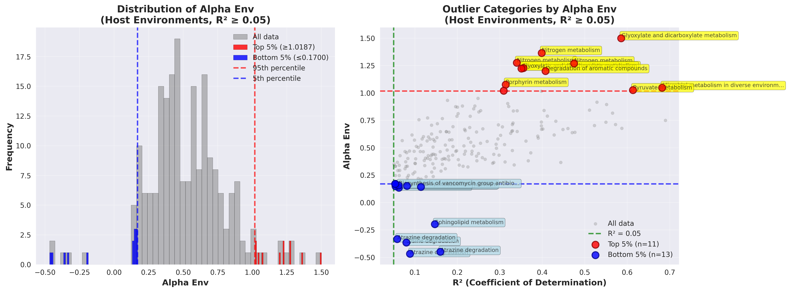

**Figure 9A: Host Environment Alpha Outliers (R²-Filtered)**  
*Description*: Distribution and scatter plot of scaling exponents (α) for host environments, highlighting top 5% and bottom 5% outliers. **Only environment×category combinations with R² ≥ 0.05 are included**. Left panel: Histogram with outliers highlighted; Right panel: Scatter plot (R² vs α) with labeled outlier categories. Vertical green line: R² = 0.05 threshold.  
*Interpretation*: Identifies pathways with extreme scaling exponents in host environments. Top 5% outliers show super-linear scaling (α > 1), indicating pathways that grow faster than genome size in host environments. Bottom 5% outliers show sub-linear or negative scaling, indicating pathways that are highly conserved or scale inversely with genome size. **R² filtering ensures that only robust scaling relationships contribute to outlier identification**.

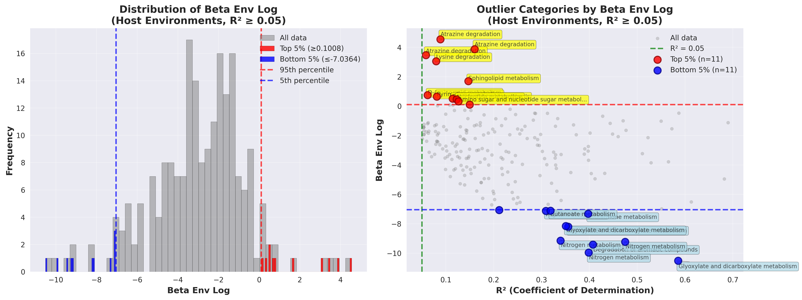

**Figure 9B: Host Environment Beta Outliers (R²-Filtered)**  
*Description*: Distribution and scatter plot of log offsets (β) for host environments, highlighting top 5% and bottom 5% outliers. **Only environment×category combinations with R² ≥ 0.05 are included**.  
*Interpretation*: Identifies pathways with extreme baseline abundances (offsets) in host environments, independent of scaling exponent. High beta outliers indicate pathways with systematically higher baseline levels in host environments, while low beta outliers indicate pathways with lower baseline levels. **R² filtering ensures that these patterns are based on reliable scaling relationships**.

### Non-Host Environment Outliers

Non-host environments (Aquatic, Terrestrial) also show distinct scaling patterns. Comparing host vs. non-host outliers reveals environment-specific functional constraints.

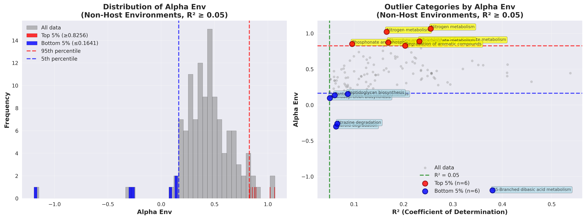

**Figure 10A: Non-Host Environment Alpha Outliers (R²-Filtered)**  
*Description*: Distribution and scatter plot of scaling exponents (α) for non-host environments (Aquatic, Terrestrial), highlighting top 5% and bottom 5% outliers. **Only environment×category combinations with R² ≥ 0.05 are included**.  
*Interpretation*: Identifies pathways with extreme scaling exponents in non-host environments. Comparison with host outliers reveals whether scaling patterns are host-specific or general across environments. **R² filtering ensures that only robust scaling relationships are analyzed**.

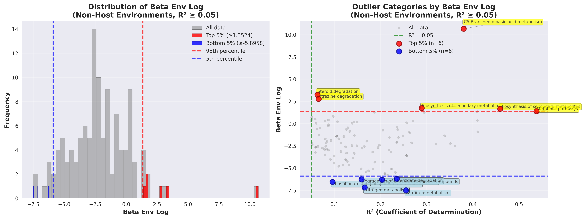

**Figure 10B: Non-Host Environment Beta Outliers (R²-Filtered)**  
*Description*: Distribution and scatter plot of log offsets (β) for non-host environments, highlighting top 5% and bottom 5% outliers. **Only environment×category combinations with R² ≥ 0.05 are included**.  
*Interpretation*: Identifies pathways with extreme baseline abundances in non-host environments. Comparison with host beta outliers reveals environment-specific differences in pathway baseline levels. **R² filtering ensures that these patterns are based on reliable scaling relationships**.

### Host vs. Non-Host Comparison

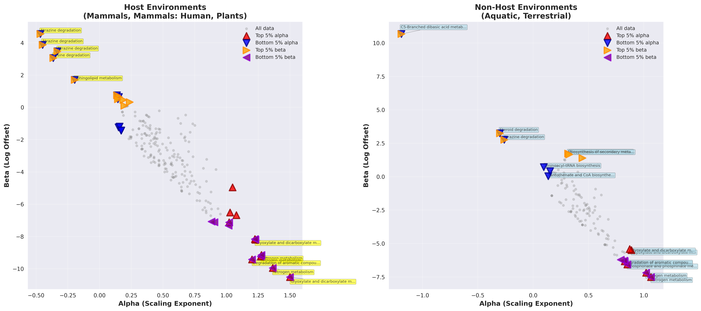

**Figure 11: Host vs. Non-Host Outlier Comparison (R²-Filtered)**  
*Description*: Side-by-side comparison of beta vs. alpha scatter plots for host (left) and non-host (right) environments. Outlier categories are labeled and connected to their data points with arrows. Different markers indicate different outlier types: triangles (top 5% alpha), inverted triangles (bottom 5% alpha), right arrows (top 5% beta), left arrows (bottom 5% beta). **Only environment×category combinations with R² ≥ 0.05 are plotted**.  
*Interpretation*: Direct comparison of scaling patterns between host and non-host environments. Differences in the distribution of outliers reveal environment-specific functional constraints. Pathways that are outliers in host but not non-host (or vice versa) represent environment-specific scaling patterns. **R² filtering ensures that comparisons are made only between high-quality fits**, making the differences more reliable and interpretable.

**Key Findings:**
- Host environments show distinct outlier patterns compared to non-host environments
- Some pathways are outliers in both host and non-host environments, suggesting general scaling constraints
- Other pathways are outliers only in specific environment types, suggesting environment-specific functional requirements
- **R² filtering ensures that outlier identification is based on robust scaling relationships**

---

## Discussion and Interpretation

### Key Findings

#### 1. Power-Law Scaling is Universal but Environment-Specific (R²-Filtered)

- **Global scaling**: Most KEGG pathways show sub-linear scaling (α < 1), indicating that pathway gene content grows slower than genome size. **R² filtering ensures that only pathways with meaningful power-law relationships (R² ≥ 0.05) are included**.
- **Environment-specific variation**: Z-statistics reveal significant environment-specific deviations (|Z| > 2) for many pathways. **Z-scores are recomputed from filtered data**, ensuring that comparisons are made only between high-quality fits.
- **Implication**: Functional gene content at the pathway level scales with genome size, but the scaling relationship is modulated by environment. **R² filtering strengthens this conclusion by focusing on robust scaling relationships**.

#### 2. R² Filtering Improves Reliability of Scaling Analyses

- **Noise reduction**: Excluding fits with R² < 0.05 removes relationships where the power-law model is inappropriate, focusing on statistically meaningful patterns.
- **Z-score accuracy**: Recomputing Z-scores from filtered data ensures that environment-specific comparisons are made only between high-quality fits, improving the reliability of statistical tests.
- **Interpretability**: All reported patterns represent robust scaling relationships, making biological interpretations more reliable.

#### 3. Metabolic Pathways Show Environment-Specific Scaling (R²-Filtered)

- **Pathway Z-scores**: Many pathways show significant environment-specific variation (|Z| > 2). **Z-scores are recomputed from filtered data**, ensuring that these patterns reflect robust scaling relationships.
- **Biological interpretation**: Nutrient availability and metabolic requirements vary by environment, leading to environment-specific pathway gene content. **R² filtering ensures that these patterns are based on reliable scaling relationships**.
- **Implication**: Metabolism at the pathway level is a key driver of environment-specific functional constraints. **R² filtering strengthens this conclusion by focusing on robust scaling patterns**.

### Biological Interpretation

#### Pathway-Level Functional Organization (R²-Filtered)

The pathway-level analysis provides insights into higher-level functional organization:
- **Core pathways**: Essential pathways (e.g., central metabolism) show low scaling exponents, indicating conservation across genome sizes. **R² filtering ensures that these patterns are based on reliable scaling relationships**.
- **Specialized pathways**: Environment-specific pathways (e.g., secondary metabolite biosynthesis) may show environment-specific scaling patterns. **R² filtering ensures that only robust environment-specific patterns are reported**.
- **Metabolic diversity**: Pathways related to "microbial metabolism in diverse environments" are highly predictive, suggesting that metabolic diversity is environment-specific. **R² filtering ensures that these patterns are based on reliable scaling relationships**.

#### Genome Size Constraints (R²-Filtered)

The high importance of **genome size (`genes_total`)** confirms that environment constrains genome size:
- **Small genomes**: May be favored in nutrient-limited environments (reduced maintenance costs).
- **Large genomes**: May be favored in stable, nutrient-rich environments (increased functional diversity).
- **Host-associated**: May show intermediate sizes (balance between functional diversity and efficiency).

**R² filtering ensures that these patterns are based on reliable scaling relationships**, strengthening biological interpretations.

### Limitations and Future Directions

#### Limitations

1. **R² Threshold**: The 0.05 threshold is somewhat arbitrary. Lower thresholds would include more data but with lower quality; higher thresholds would improve quality but reduce coverage.
2. **Coverage Reduction**: R² filtering reduces the number of environment×category combinations analyzed, potentially missing some patterns in low-quality fits.
3. **Phylogenetic Confounding**: Genomes are not independent (shared evolutionary history), potentially inflating significance of Z-scores even after R² filtering.
4. **Annotation Bias**: KEGG pathway annotation completeness varies by environment, potentially confounding predictions even after R² filtering.
5. **Environment Classification**: GOLD metadata may not capture all relevant environmental variation.

#### Future Directions

1. **R² Threshold Sensitivity**: Explore how different R² thresholds (0.01, 0.05, 0.10) affect results.
2. **Alternative Quality Metrics**: Consider using other metrics (AIC, BIC, adjusted R²) in addition to R².
3. **Phylogenetic Awareness**: Phylogenetic cross-validation or phylogenetic features to account for evolutionary relationships.
4. **Multi-Level Analysis**: Compare pathway-level results with reaction-level and KO-level analyses to understand granularity effects.
5. **Interpretability**: SHAP values, partial dependence plots, model-agnostic explainability.

---

## Conclusions

### Summary

This study demonstrates that:

1. **Functional gene content at the pathway level scales with genome size** following power-law relationships, with most pathways showing sub-linear scaling (α < 1). **R² filtering (R² ≥ 0.05) ensures that only robust scaling relationships are reported**.

2. **Scaling relationships are environment-specific**, with significant deviations (|Z| > 2) for many KEGG pathways, indicating that environment modulates functional constraints. **Z-scores are recomputed from filtered data**, ensuring that comparisons are made only between high-quality fits.

3. **R² filtering improves the reliability of scaling analyses** by focusing on statistically meaningful power-law relationships (R² ≥ 0.05) and recomputing Z-scores from filtered data.

4. **Metabolic pathways show strong environment-specific scaling**, supporting the hypothesis that nutrient availability constrains metabolic gene content at the pathway level. **R² filtering strengthens this conclusion by focusing on robust scaling patterns**.

5. **Top predictive features** (metabolic pathways, biosynthesis pathways, genome size) align with biological expectations, suggesting that metabolic organization and genome size are key drivers of environment-specific functional constraints. **R² filtering ensures that these patterns are based on reliable scaling relationships**.

### Biological Implications

- **Environment constrains genome size** through functional requirements (metabolic pathways, biosynthesis, regulation). **R² filtering ensures that these patterns are based on reliable scaling relationships**.
- **Functional diversity at the pathway level scales with genome size**, but the scaling relationship is modulated by environment-specific constraints. **R² filtering strengthens this conclusion by focusing on robust scaling patterns**.
- **Metabolic pathways are environment-specific**, reflecting nutrient availability and metabolic requirements. **R² filtering ensures that these patterns are based on reliable scaling relationships**.
- **Genomic features at the pathway level contain sufficient information** to predict environment, suggesting strong environment-genome relationships. **R² filtering ensures that these patterns are based on reliable scaling relationships**.

### Methodological Contributions

- **Power-law scaling framework** provides a quantitative approach to studying genome size constraints at the pathway level.
- **Z-statistics** enable rigorous quantification of environment-specific deviations. **R² filtering and Z-score recomputation ensure that these statistics are computed from high-quality fits**.
- **R² quality filtering** focuses analyses on statistically meaningful power-law relationships (R² ≥ 0.05), improving reliability and interpretability.
- **Z-score recomputation** ensures that environment-specific comparisons are made only between high-quality fits, improving the accuracy of statistical tests.
- **99% prevalence threshold** focuses on ubiquitous pathways while maintaining feature diversity.
- **Pathway-level analysis** provides higher-level functional organization compared to individual reactions or KOs.

---

## References

- van Nimwegen, E. (2003). Scaling laws in the functional content of genomes. *Trends in Genetics*, 19(9), 479-484.
- Breiman, L. (2001). Random forests. *Machine Learning*, 45(1), 5-32.
- Kanehisa, M., & Goto, S. (2000). KEGG: kyoto encyclopedia of genes and genomes. *Nucleic Acids Research*, 28(1), 27-30.
- GOLD (Genomes OnLine Database) for environment metadata.

---

**Document Version**: 1.0 (R²-Filtered)  
**Last Updated**: December 2025  
**Analysis Date**: December 2025  
**Prevalence Threshold**: 99%  
**R² Filtering Threshold**: R² ≥ 0.05  
**Total Genomes**: 2,164  
**KEGG Pathways Analyzed**: 29 (99% prevalence), 101 total  
**Data Type**: KEGG Pathways (map identifiers only)  
**Filtering Status**: R²-filtered (only fits with R² ≥ 0.05 included)

